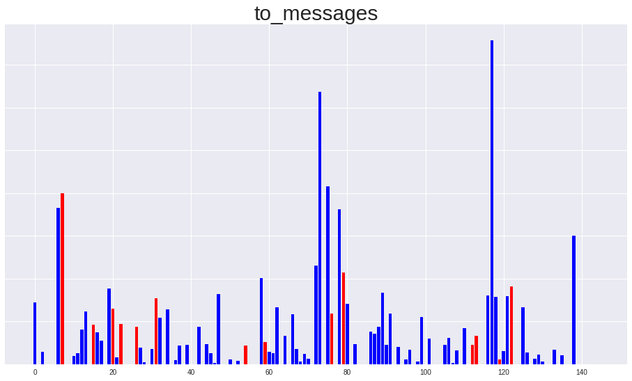
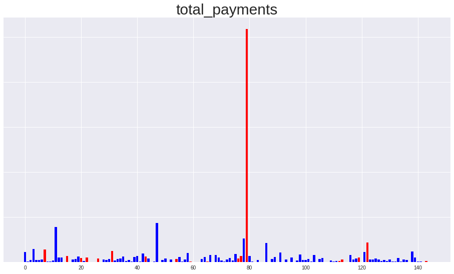
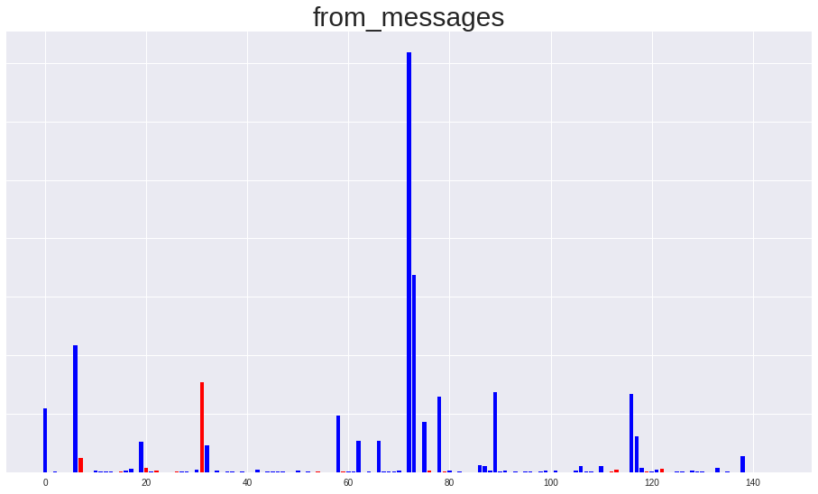
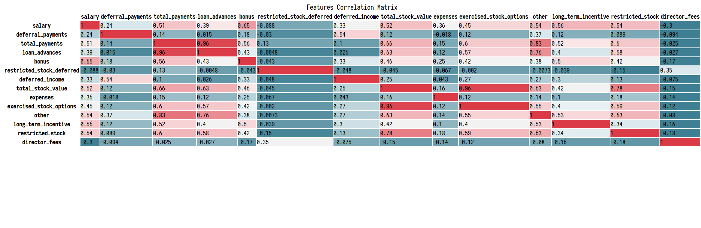
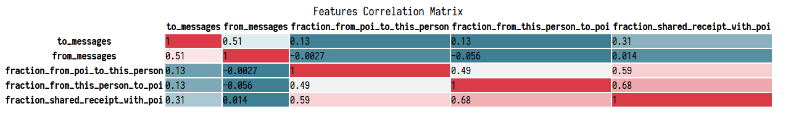

# Project Overview
This project is aimed to identified the person of interest in Enron scandal.

In 2000, Enron was one of the largest companies in the United States.
By 2002, it had collapsed into bankruptcy due to widespread corporate fraud.
In the resulting Federal investigation, a significant amount of typically
confidential information entered into the public record, including tens of
thousands of emails and detailed financial data for top executives.
In this project, I will try to build a detecitve model to identify the
person of interest in Enron scandal, based on financial and email data
made public as a result of the Enron scandal.

# Dataset overview

characteristics | overview
--- | ---
Total number of persons| 146
Total number of persons of interest (POI) | 18
Total number of non persons of interest (non POI) | 128
Total number of features | 19
Total number of finance features | 14
Total number of email features | 5

First of all, just load the dictionary containing the dataset.

And take all features into list.
```python
finance_features_list = ['poi', 'salary', 'deferral_payments',
                         'total_payments', 'loan_advances', 'bonus',
                         'restricted_stock_deferred',
                         'deferred_income', 'total_stock_value', 'expenses',
                         'exercised_stock_options', 'other',
                         'long_term_incentive', 'restricted_stock',
                         'director_fees']

email_features_list = ['poi', 'to_messages',
                       'from_poi_to_this_person', 'from_messages',
                       'from_this_person_to_poi', 'shared_receipt_with_poi']
```

# Remove outliers
```
data_dict.pop("TOTAL", 0)
```

    {'bonus': 97343619,
     'deferral_payments': 32083396,
     'deferred_income': -27992891,
     'director_fees': 1398517,
     'email_address': 'NaN',
     'exercised_stock_options': 311764000,
     'expenses': 5235198,
     'from_messages': 'NaN',
     'from_poi_to_this_person': 'NaN',
     'from_this_person_to_poi': 'NaN',
     'loan_advances': 83925000,
     'long_term_incentive': 48521928,
     'other': 42667589,
     'poi': False,
     'restricted_stock': 130322299,
     'restricted_stock_deferred': -7576788,
     'salary': 26704229,
     'shared_receipt_with_poi': 'NaN',
     'to_messages': 'NaN',
     'total_payments': 309886585,
     'total_stock_value': 434509511}


# Create new features

Transform
* "from_poi_to_this_person"
* "from_this_person_to_poi"
* "shared_receipt_with_poi"

to percent

```
'fraction_from_poi_to_this_person' = from_poi_to_this_person" / "to_messages"    
'fraction_from_this_person_to_poi' =  from_this_person_to_poi" / "from_messages"    
'fraction_shared_receipt_with_poi' = "shared_receipt_with_poi" / "to_messages"    
```

# Check features NaN percentile


    salary nan percentile: 0.35172413793103446
    deferral_payments nan percentile: 0.7379310344827587
    total_payments nan percentile: 0.14482758620689656
    loan_advances nan percentile: 0.9793103448275862
    bonus nan percentile: 0.4413793103448276
    restricted_stock_deferred nan percentile: 0.8827586206896552
    deferred_income nan percentile: 0.6689655172413793
    total_stock_value nan percentile: 0.13793103448275862
    expenses nan percentile: 0.35172413793103446
    exercised_stock_options nan percentile: 0.30344827586206896
    other nan percentile: 0.36551724137931035
    long_term_incentive nan percentile: 0.5517241379310345
    restricted_stock nan percentile: 0.2482758620689655
    director_fees nan percentile: 0.8896551724137931
    to_messages nan percentile: 0.4068965517241379
    from_messages nan percentile: 0.4068965517241379
    fraction_from_poi_to_this_person nan percentile: 0.0
    fraction_from_this_person_to_poi nan percentile: 0.0
    fraction_shared_receipt_with_poi nan percentile: 0.0


# Minmax scaling
first fill the NaN with 0 and then do minmax scaling on all features except
"poi", "raction_from_poi_to_this_person", "fraction_from_this_person_to_poi", "fraction_shared_receipt_with_poi".

# Remove the features above 70% nan percent

    deferral_payments nan percentile: 0.7379310344827587
    loan_advances nan percentile: 0.9793103448275862
    restricted_stock_deferred nan percentile: 0.8827586206896552
    director_fees nan percentile: 0.8896551724137931

# Visualize features distribution










From the deferred_income bar chart I find that the deferred_income should be transform to positive values so as to keep align with other features.

```python
df["deferred_income"] = df["deferred_income"].abs()
```

After looking through the bar chart, I decide to remove 'from_messages', 'to_messages', 'total_payments' since they are noisy and having outliers.

# Plot Correlation Matrix







# PCA
From the correlation matrix we can see that
* "exercised_stock_options"
* "restricted_stock"
* "total_stock_value"  
are highly related.   

So I decide to use PCA to transform them into one new feature.

# Sort features importance

When I use the random forest classifier on the features, I get the feature
importances as below:  

features | importances
---- | ----
other | 0.20126948
expenses | 0.18295673
fraction_from_this_person_to_poi | 0.14281353
stock_pca | 0.1413511
bonus | 0.09962223
salary | 0.06444563
fraction_from_poi_to_this_person | 0.05627843
deferred_income | 0.04823193
fraction_shared_receipt_with_poi | 0.03722525
long_term_incentive | 0.02580569

While using the adaboost classifier on the features, I get the feature
importances as below:  

features | importances
---- | ----
bonus | 0.32
other | 0.28
stock_pca | 0.12
expenses | 0.08
fraction_from_this_person_to_poi | 0.08
salary | 0.06
fraction_shared_receipt_with_poi | 0.06
deferred_income | 0.0
long_term_incentive | 0.0
fraction_from_poi_to_this_person | 0.0

I noticed that both long_term_incentive and deferred_income are appeared on the last three importances in both random forest and adaboost. Consequently and last but not least, I remove them and make my final features.


# Final result

In the end, the random forest have best performance with both precision and recall above 0.5

```
Fitting the classifier to the training set
done in 44.293s
RandomForestClassifier(bootstrap=True, class_weight='balanced',
            criterion='gini', max_depth=3, max_features='auto',
            max_leaf_nodes=None, min_impurity_decrease=0.0,
            min_impurity_split=None, min_samples_leaf=2,
            min_samples_split=2, min_weight_fraction_leaf=0.0,
            n_estimators=150, n_jobs=-1, oob_score=True, random_state=42,
            verbose=0, warm_start=False)
Predicting on the training set
Done in 0.108s
             precision    recall  f1-score   support

      False       1.00      0.95      0.98        87
       True       0.78      1.00      0.88        14

avg / total       0.97      0.96      0.96       101

[[83  4]
 [ 0 14]]
Predicting on the testing set
Done in 0.109s
             precision    recall  f1-score   support

      False       0.97      0.90      0.94        40
       True       0.43      0.75      0.55         4

avg / total       0.92      0.89      0.90        44

[[36  4]
 [ 1  3]]
[ 0.25971066  0.15720848  0.14366712  0.11810359  0.11421972  0.09725698
  0.0694345   0.04039894]
['expenses' 'fraction_from_this_person_to_poi' 'other' 'stock_pca' 'bonus'
 'salary' 'fraction_from_poi_to_this_person'
 'fraction_shared_receipt_with_poi']
RandomForestClassifier(bootstrap=True, class_weight='balanced',
            criterion='gini', max_depth=3, max_features='auto',
            max_leaf_nodes=None, min_impurity_decrease=0.0,
            min_impurity_split=None, min_samples_leaf=2,
            min_samples_split=2, min_weight_fraction_leaf=0.0,
            n_estimators=150, n_jobs=-1, oob_score=True, random_state=42,
            verbose=0, warm_start=False)
	Accuracy: 0.87533	Precision: 0.53081	Recall: 0.56000	F1: 0.54501	F2: 0.55391
	Total predictions: 15000	True positives: 1120	False positives:  990	False negatives:  880	True negatives: 12010
```

# Reflexion

Since this is an imbalanced labeled and small dataset, it is hard to test whether a
classifier is good.

In training process, many classifier get amazing score in classification_report
and confusion_matrix, but just gain disappointed score using StratifiedShuffleSplit.

At first, the random forest just get average score. But when I tune the max_depth, its performance improved
amazingly.

Logistic perform well on identify the POIs with recall over 0.7.
