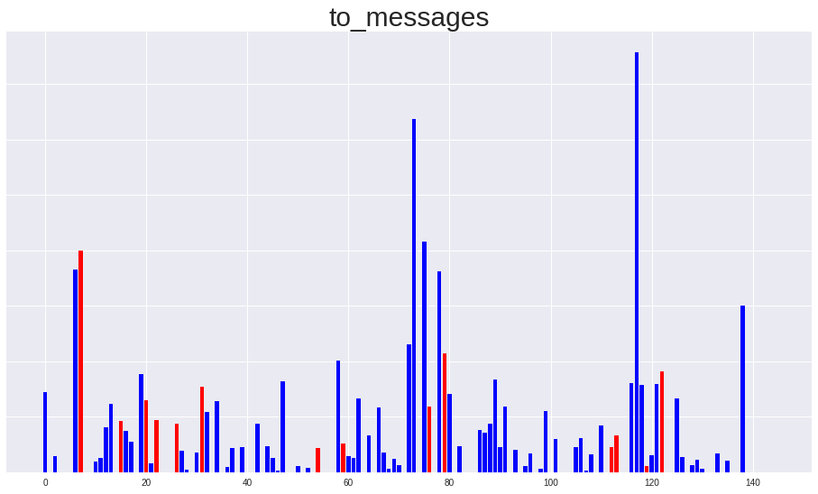
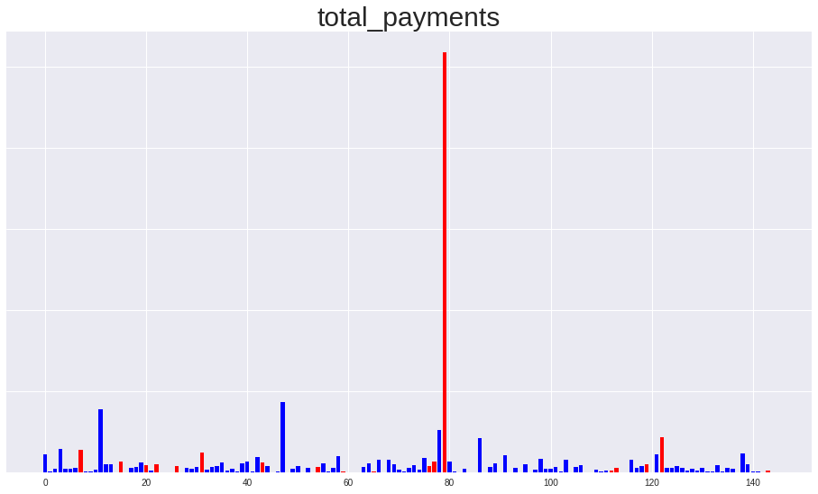
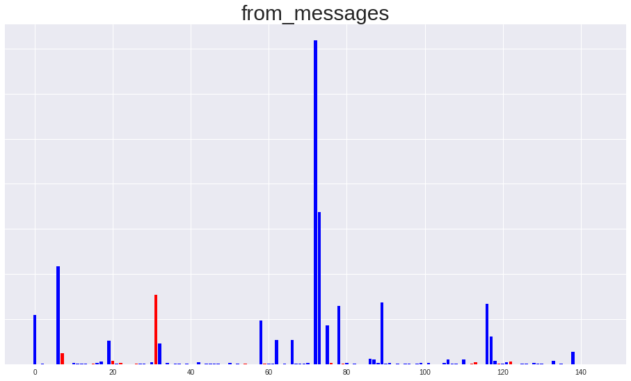

# Project Overview
This project is aimed to identified the person of interest in Enron scandal.

In 2000, Enron was one of the largest companies in the United States.
By 2002, it had collapsed into bankruptcy due to widespread corporate fraud.
In the resulting Federal investigation, a significant amount of typically
confidential information entered into the public record, including tens of
thousands of emails and detailed financial data for top executives.
In this project, I will try to build a detecitve model to identify the
person of interest in Enron scandal, based on financial and email data
made public as a result of the Enron scandal.

# Preparation
First of all, just load the dictionary containing the dataset.

And take all features into list.
```python
finance_features_list = ['poi', 'salary', 'deferral_payments',
                         'total_payments', 'loan_advances', 'bonus',
                         'restricted_stock_deferred',
                         'deferred_income', 'total_stock_value', 'expenses',
                         'exercised_stock_options', 'other',
                         'long_term_incentive', 'restricted_stock',
                         'director_fees']

email_features_list = ['poi', 'to_messages',
                       'from_poi_to_this_person', 'from_messages',
                       'from_this_person_to_poi', 'shared_receipt_with_poi']
```

What is more, define four classifier used in this project:
random forest, adaboost, logistic and svm.

# Remove outliers
```
data_dict.pop("TOTAL", 0)
```

    {'bonus': 97343619,
     'deferral_payments': 32083396,
     'deferred_income': -27992891,
     'director_fees': 1398517,
     'email_address': 'NaN',
     'exercised_stock_options': 311764000,
     'expenses': 5235198,
     'from_messages': 'NaN',
     'from_poi_to_this_person': 'NaN',
     'from_this_person_to_poi': 'NaN',
     'loan_advances': 83925000,
     'long_term_incentive': 48521928,
     'other': 42667589,
     'poi': False,
     'restricted_stock': 130322299,
     'restricted_stock_deferred': -7576788,
     'salary': 26704229,
     'shared_receipt_with_poi': 'NaN',
     'to_messages': 'NaN',
     'total_payments': 309886585,
     'total_stock_value': 434509511}


# Create new features

Transform "from_poi_to_this_person", "from_this_person_to_poi", "shared_receipt_with_poi"
to percentile.

'fraction_from_poi_to_this_person' = from_poi_to_this_person" / "to_messages"    
'fraction_from_this_person_to_poi' =  from_this_person_to_poi" / "from_messages"    
'fraction_shared_receipt_with_poi' = "shared_receipt_with_poi" / "to_messages"    

# Check features NaN percentile


    salary nan percentile: 0.35172413793103446
    deferral_payments nan percentile: 0.7379310344827587
    total_payments nan percentile: 0.14482758620689656
    loan_advances nan percentile: 0.9793103448275862
    bonus nan percentile: 0.4413793103448276
    restricted_stock_deferred nan percentile: 0.8827586206896552
    deferred_income nan percentile: 0.6689655172413793
    total_stock_value nan percentile: 0.13793103448275862
    expenses nan percentile: 0.35172413793103446
    exercised_stock_options nan percentile: 0.30344827586206896
    other nan percentile: 0.36551724137931035
    long_term_incentive nan percentile: 0.5517241379310345
    restricted_stock nan percentile: 0.2482758620689655
    director_fees nan percentile: 0.8896551724137931
    to_messages nan percentile: 0.4068965517241379
    from_messages nan percentile: 0.4068965517241379
    fraction_from_poi_to_this_person nan percentile: 0.0
    fraction_from_this_person_to_poi nan percentile: 0.0
    fraction_shared_receipt_with_poi nan percentile: 0.0


# Minmax scaling
first fill the NaN with 0 and then do minmax scaling on all features except
"poi", "raction_from_poi_to_this_person", "fraction_from_this_person_to_poi", "fraction_shared_receipt_with_poi".

# First Test
```
Fitting the classifier to the training set
done in 13.479s
RandomForestClassifier(bootstrap=True, class_weight='balanced',
            criterion='gini', max_depth=None, max_features='auto',
            max_leaf_nodes=None, min_impurity_decrease=0.0,
            min_impurity_split=None, min_samples_leaf=2,
            min_samples_split=2, min_weight_fraction_leaf=0.0,
            n_estimators=50, n_jobs=-1, oob_score=True, random_state=42,
            verbose=0, warm_start=False)
Predicting on the training set
Done in 0.112s
             precision    recall  f1-score   support

      False       1.00      0.99      0.99        87
       True       0.93      1.00      0.97        14

avg / total       0.99      0.99      0.99       101

[[86  1]
 [ 0 14]]
Predicting on the testing set
Done in 0.107s
             precision    recall  f1-score   support

      False       0.93      1.00      0.96        40
       True       1.00      0.25      0.40         4

avg / total       0.94      0.93      0.91        44

[[40  0]
 [ 3  1]]
RandomForestClassifier(bootstrap=True, class_weight='balanced',
            criterion='gini', max_depth=None, max_features='auto',
            max_leaf_nodes=None, min_impurity_decrease=0.0,
            min_impurity_split=None, min_samples_leaf=2,
            min_samples_split=2, min_weight_fraction_leaf=0.0,
            n_estimators=50, n_jobs=-1, oob_score=True, random_state=42,
            verbose=0, warm_start=False)
	Accuracy: 0.86507	Precision: 0.48667	Recall: 0.21900	F1: 0.30207	F2: 0.24607
	Total predictions: 15000	True positives:  438	False positives:  462	False negatives: 1562	True negatives: 12538

Fitting the classifier to the training set
done in 26.598s
AdaBoostClassifier(algorithm='SAMME.R', base_estimator=None,
          learning_rate=0.1, n_estimators=175, random_state=42)
Predicting on the training set
Done in 0.031s
             precision    recall  f1-score   support

      False       1.00      1.00      1.00        87
       True       1.00      1.00      1.00        14

avg / total       1.00      1.00      1.00       101

[[87  0]
 [ 0 14]]
Predicting on the testing set
Done in 0.027s
             precision    recall  f1-score   support

      False       0.95      0.93      0.94        40
       True       0.40      0.50      0.44         4

avg / total       0.90      0.89      0.89        44

[[37  3]
 [ 2  2]]
AdaBoostClassifier(algorithm='SAMME.R', base_estimator=None,
          learning_rate=0.1, n_estimators=175, random_state=42)
	Accuracy: 0.84933	Precision: 0.40972	Recall: 0.29500	F1: 0.34302	F2: 0.31250
	Total predictions: 15000	True positives:  590	False positives:  850	False negatives: 1410	True negatives: 12150

Fitting the classifier to the training set
done in 2.940s
LogisticRegression(C=1, class_weight='balanced', dual=False,
          fit_intercept=True, intercept_scaling=1, max_iter=100,
          multi_class='ovr', n_jobs=1, penalty='l2', random_state=None,
          solver='liblinear', tol=1e-05, verbose=0, warm_start=False)
Predicting on the training set
Done in 0.003s
             precision    recall  f1-score   support

      False       0.95      0.80      0.87        87
       True       0.37      0.71      0.49        14

avg / total       0.87      0.79      0.82       101

[[70 17]
 [ 4 10]]
Predicting on the testing set
Done in 0.000s
             precision    recall  f1-score   support

      False       0.97      0.78      0.86        40
       True       0.25      0.75      0.38         4

avg / total       0.90      0.77      0.82        44

[[31  9]
 [ 1  3]]
GridSearchCV(cv=None, error_score='raise',
       estimator=LogisticRegression(C=1.0, class_weight='balanced', dual=False,
          fit_intercept=True, intercept_scaling=1, max_iter=100,
          multi_class='ovr', n_jobs=1, penalty='l2', random_state=None,
          solver='liblinear', tol=0.0001, verbose=0, warm_start=False),
       fit_params={}, iid=True, n_jobs=1,
       param_grid={'C': [0.1, 0.5, 1, 5, 10, 50, 100], 'tol': [1e-05, 5e-05, 0.0001, 0.0005, 0.001, 0.005, 0.01], 'max_iter': [100, 150, 200, 250, 300]},
       pre_dispatch='2*n_jobs', refit=True, scoring='f1', verbose=0)
	Accuracy: 0.74160	Precision: 0.27635	Recall: 0.57950	F1: 0.37423	F2: 0.47523
	Total predictions: 15000	True positives: 1159	False positives: 3035	False negatives:  841	True negatives: 9965

Fitting the classifier to the training set
done in 0.518s
Best estimator found by grid search:
SVC(C=0.5, cache_size=200, class_weight='balanced', coef0=0.0,
  decision_function_shape='ovr', degree=3, gamma=0.1, kernel='rbf',
  max_iter=-1, probability=False, random_state=None, shrinking=True,
  tol=0.001, verbose=False)
Predicting on the training set
Done in 0.001s
             precision    recall  f1-score   support

      False       0.93      0.76      0.84        87
       True       0.30      0.64      0.41        14

avg / total       0.84      0.74      0.78       101

[[66 21]
 [ 5  9]]
Predicting on the testing set
Done in 0.000s
             precision    recall  f1-score   support

      False       1.00      0.72      0.84        40
       True       0.27      1.00      0.42         4

avg / total       0.93      0.75      0.80        44

[[29 11]
 [ 0  4]]
GridSearchCV(cv=None, error_score='raise',
       estimator=SVC(C=1.0, cache_size=200, class_weight='balanced', coef0=0.0,
  decision_function_shape='ovr', degree=3, gamma='auto', kernel='rbf',
  max_iter=-1, probability=False, random_state=None, shrinking=True,
  tol=0.001, verbose=False),
       fit_params={}, iid=True, n_jobs=1,
       param_grid={'C': [0.01, 0.05, 0.1, 0.5, 1, 5, 10, 50], 'gamma': [0.001, 0.005, 0.01, 0.05, 0.1]},
       pre_dispatch='2*n_jobs', refit=True, scoring='f1', verbose=0)
	Accuracy: 0.71847	Precision: 0.26887	Recall: 0.64650	F1: 0.37979	F2: 0.50472
	Total predictions: 15000	True positives: 1293	False positives: 3516	False negatives:  707	True negatives: 9484
```

No suprise, there are no good classifier using all features.

# Remove the features above 70% nan percent

    deferral_payments nan percentile: 0.7379310344827587
    loan_advances nan percentile: 0.9793103448275862
    restricted_stock_deferred nan percentile: 0.8827586206896552
    director_fees nan percentile: 0.8896551724137931

# Visualize features distribution
```python
# use visualization to filter features.
univariate_plot(df)
```











From the deferred_income bar chart I find that the deferred_income should be transform to positive values so as to keep align with other features.

```python
df["deferred_income"] = df["deferred_income"].abs()
```

After looking through the bar chart, I decide to remove 'from_messages', 'to_messages', 'total_payments' since they are noisy and having outliers.

# Plot Correlation Matrix

<style  type="text/css" >

    #T_785e088d_9f07_11e7_bb4e_8c705a224764 th {

        font-size: 7pt;

    }

    #T_785e088d_9f07_11e7_bb4e_8c705a224764 td {

        padding: 0em 0em;

    }

    #T_785e088d_9f07_11e7_bb4e_8c705a224764 th:hover {

        font-size: 12pt;

    }

    #T_785e088d_9f07_11e7_bb4e_8c705a224764 tr:hover td:hover {

        max-width: 200px;

        font-size: 12pt;

    }


    #T_785e088d_9f07_11e7_bb4e_8c705a224764row0_col0 {

        background-color:  #da3b46;

        max-width:  80px;

        font-size:  10pt;

        background-color:  #da3b46;

        max-width:  80px;

        font-size:  10pt;

    }

    #T_785e088d_9f07_11e7_bb4e_8c705a224764row0_col1 {

        background-color:  #d8e7eb;

        max-width:  80px;

        font-size:  10pt;

        background-color:  #d8e7eb;

        max-width:  80px;

        font-size:  10pt;

    }

    #T_785e088d_9f07_11e7_bb4e_8c705a224764row0_col2 {

        background-color:  #f4c4c8;

        max-width:  80px;

        font-size:  10pt;

        background-color:  #f4c4c8;

        max-width:  80px;

        font-size:  10pt;

    }

    #T_785e088d_9f07_11e7_bb4e_8c705a224764row0_col3 {

        background-color:  #fae7e8;

        max-width:  80px;

        font-size:  10pt;

        background-color:  #fae7e8;

        max-width:  80px;

        font-size:  10pt;

    }

    #T_785e088d_9f07_11e7_bb4e_8c705a224764row0_col4 {

        background-color:  #ec9ca2;

        max-width:  80px;

        font-size:  10pt;

        background-color:  #ec9ca2;

        max-width:  80px;

        font-size:  10pt;

    }

    #T_785e088d_9f07_11e7_bb4e_8c705a224764row0_col5 {

        background-color:  #7aa7b5;

        max-width:  80px;

        font-size:  10pt;

        background-color:  #7aa7b5;

        max-width:  80px;

        font-size:  10pt;

    }

    #T_785e088d_9f07_11e7_bb4e_8c705a224764row0_col6 {

        background-color:  #f2f2f2;

        max-width:  80px;

        font-size:  10pt;

        background-color:  #f2f2f2;

        max-width:  80px;

        font-size:  10pt;

    }

    #T_785e088d_9f07_11e7_bb4e_8c705a224764row0_col7 {

        background-color:  #f3c0c4;

        max-width:  80px;

        font-size:  10pt;

        background-color:  #f3c0c4;

        max-width:  80px;

        font-size:  10pt;

    }

    #T_785e088d_9f07_11e7_bb4e_8c705a224764row0_col8 {

        background-color:  #f2f2f2;

        max-width:  80px;

        font-size:  10pt;

        background-color:  #f2f2f2;

        max-width:  80px;

        font-size:  10pt;

    }

    #T_785e088d_9f07_11e7_bb4e_8c705a224764row0_col9 {

        background-color:  #f7d6d8;

        max-width:  80px;

        font-size:  10pt;

        background-color:  #f7d6d8;

        max-width:  80px;

        font-size:  10pt;

    }

    #T_785e088d_9f07_11e7_bb4e_8c705a224764row0_col10 {

        background-color:  #f2bcc0;

        max-width:  80px;

        font-size:  10pt;

        background-color:  #f2bcc0;

        max-width:  80px;

        font-size:  10pt;

    }

    #T_785e088d_9f07_11e7_bb4e_8c705a224764row0_col11 {

        background-color:  #f1b6ba;

        max-width:  80px;

        font-size:  10pt;

        background-color:  #f1b6ba;

        max-width:  80px;

        font-size:  10pt;

    }

    #T_785e088d_9f07_11e7_bb4e_8c705a224764row0_col12 {

        background-color:  #f2bcc0;

        max-width:  80px;

        font-size:  10pt;

        background-color:  #f2bcc0;

        max-width:  80px;

        font-size:  10pt;

    }

    #T_785e088d_9f07_11e7_bb4e_8c705a224764row0_col13 {

        background-color:  #3f7f93;

        max-width:  80px;

        font-size:  10pt;

        background-color:  #3f7f93;

        max-width:  80px;

        font-size:  10pt;

    }

    #T_785e088d_9f07_11e7_bb4e_8c705a224764row1_col0 {

        background-color:  #b0cbd4;

        max-width:  80px;

        font-size:  10pt;

        background-color:  #b0cbd4;

        max-width:  80px;

        font-size:  10pt;

    }

    #T_785e088d_9f07_11e7_bb4e_8c705a224764row1_col1 {

        background-color:  #da3b46;

        max-width:  80px;

        font-size:  10pt;

        background-color:  #da3b46;

        max-width:  80px;

        font-size:  10pt;

    }

    #T_785e088d_9f07_11e7_bb4e_8c705a224764row1_col2 {

        background-color:  #8eb4c0;

        max-width:  80px;

        font-size:  10pt;

        background-color:  #8eb4c0;

        max-width:  80px;

        font-size:  10pt;

    }

    #T_785e088d_9f07_11e7_bb4e_8c705a224764row1_col3 {

        background-color:  #6397a7;

        max-width:  80px;

        font-size:  10pt;

        background-color:  #6397a7;

        max-width:  80px;

        font-size:  10pt;

    }

    #T_785e088d_9f07_11e7_bb4e_8c705a224764row1_col4 {

        background-color:  #99bcc7;

        max-width:  80px;

        font-size:  10pt;

        background-color:  #99bcc7;

        max-width:  80px;

        font-size:  10pt;

    }

    #T_785e088d_9f07_11e7_bb4e_8c705a224764row1_col5 {

        background-color:  #538d9e;

        max-width:  80px;

        font-size:  10pt;

        background-color:  #538d9e;

        max-width:  80px;

        font-size:  10pt;

    }

    #T_785e088d_9f07_11e7_bb4e_8c705a224764row1_col6 {

        background-color:  #f7d3d6;

        max-width:  80px;

        font-size:  10pt;

        background-color:  #f7d3d6;

        max-width:  80px;

        font-size:  10pt;

    }

    #T_785e088d_9f07_11e7_bb4e_8c705a224764row1_col7 {

        background-color:  #86afbc;

        max-width:  80px;

        font-size:  10pt;

        background-color:  #86afbc;

        max-width:  80px;

        font-size:  10pt;

    }

    #T_785e088d_9f07_11e7_bb4e_8c705a224764row1_col8 {

        background-color:  #578fa1;

        max-width:  80px;

        font-size:  10pt;

        background-color:  #578fa1;

        max-width:  80px;

        font-size:  10pt;

    }

    #T_785e088d_9f07_11e7_bb4e_8c705a224764row1_col9 {

        background-color:  #85aebb;

        max-width:  80px;

        font-size:  10pt;

        background-color:  #85aebb;

        max-width:  80px;

        font-size:  10pt;

    }

    #T_785e088d_9f07_11e7_bb4e_8c705a224764row1_col10 {

        background-color:  #d9e8ec;

        max-width:  80px;

        font-size:  10pt;

        background-color:  #d9e8ec;

        max-width:  80px;

        font-size:  10pt;

    }

    #T_785e088d_9f07_11e7_bb4e_8c705a224764row1_col11 {

        background-color:  #86afbc;

        max-width:  80px;

        font-size:  10pt;

        background-color:  #86afbc;

        max-width:  80px;

        font-size:  10pt;

    }

    #T_785e088d_9f07_11e7_bb4e_8c705a224764row1_col12 {

        background-color:  #7ba8b6;

        max-width:  80px;

        font-size:  10pt;

        background-color:  #7ba8b6;

        max-width:  80px;

        font-size:  10pt;

    }

    #T_785e088d_9f07_11e7_bb4e_8c705a224764row1_col13 {

        background-color:  #3f7f93;

        max-width:  80px;

        font-size:  10pt;

        background-color:  #3f7f93;

        max-width:  80px;

        font-size:  10pt;

    }

    #T_785e088d_9f07_11e7_bb4e_8c705a224764row2_col0 {

        background-color:  #fbeaeb;

        max-width:  80px;

        font-size:  10pt;

        background-color:  #fbeaeb;

        max-width:  80px;

        font-size:  10pt;

    }

    #T_785e088d_9f07_11e7_bb4e_8c705a224764row2_col1 {

        background-color:  #7aa7b5;

        max-width:  80px;

        font-size:  10pt;

        background-color:  #7aa7b5;

        max-width:  80px;

        font-size:  10pt;

    }

    #T_785e088d_9f07_11e7_bb4e_8c705a224764row2_col2 {

        background-color:  #da3b46;

        max-width:  80px;

        font-size:  10pt;

        background-color:  #da3b46;

        max-width:  80px;

        font-size:  10pt;

    }

    #T_785e088d_9f07_11e7_bb4e_8c705a224764row2_col3 {

        background-color:  #dc4651;

        max-width:  80px;

        font-size:  10pt;

        background-color:  #dc4651;

        max-width:  80px;

        font-size:  10pt;

    }

    #T_785e088d_9f07_11e7_bb4e_8c705a224764row2_col4 {

        background-color:  #f7d7d9;

        max-width:  80px;

        font-size:  10pt;

        background-color:  #f7d7d9;

        max-width:  80px;

        font-size:  10pt;

    }

    #T_785e088d_9f07_11e7_bb4e_8c705a224764row2_col5 {

        background-color:  #75a4b2;

        max-width:  80px;

        font-size:  10pt;

        background-color:  #75a4b2;

        max-width:  80px;

        font-size:  10pt;

    }

    #T_785e088d_9f07_11e7_bb4e_8c705a224764row2_col6 {

        background-color:  #6d9ead;

        max-width:  80px;

        font-size:  10pt;

        background-color:  #6d9ead;

        max-width:  80px;

        font-size:  10pt;

    }

    #T_785e088d_9f07_11e7_bb4e_8c705a224764row2_col7 {

        background-color:  #f1b3b8;

        max-width:  80px;

        font-size:  10pt;

        background-color:  #f1b3b8;

        max-width:  80px;

        font-size:  10pt;

    }

    #T_785e088d_9f07_11e7_bb4e_8c705a224764row2_col8 {

        background-color:  #7eaab7;

        max-width:  80px;

        font-size:  10pt;

        background-color:  #7eaab7;

        max-width:  80px;

        font-size:  10pt;

    }

    #T_785e088d_9f07_11e7_bb4e_8c705a224764row2_col9 {

        background-color:  #f5cacd;

        max-width:  80px;

        font-size:  10pt;

        background-color:  #f5cacd;

        max-width:  80px;

        font-size:  10pt;

    }

    #T_785e088d_9f07_11e7_bb4e_8c705a224764row2_col10 {

        background-color:  #e5777f;

        max-width:  80px;

        font-size:  10pt;

        background-color:  #e5777f;

        max-width:  80px;

        font-size:  10pt;

    }

    #T_785e088d_9f07_11e7_bb4e_8c705a224764row2_col11 {

        background-color:  #fae5e7;

        max-width:  80px;

        font-size:  10pt;

        background-color:  #fae5e7;

        max-width:  80px;

        font-size:  10pt;

    }

    #T_785e088d_9f07_11e7_bb4e_8c705a224764row2_col12 {

        background-color:  #f4c7cb;

        max-width:  80px;

        font-size:  10pt;

        background-color:  #f4c7cb;

        max-width:  80px;

        font-size:  10pt;

    }

    #T_785e088d_9f07_11e7_bb4e_8c705a224764row2_col13 {

        background-color:  #3f7f93;

        max-width:  80px;

        font-size:  10pt;

        background-color:  #3f7f93;

        max-width:  80px;

        font-size:  10pt;

    }

    #T_785e088d_9f07_11e7_bb4e_8c705a224764row3_col0 {

        background-color:  #d3e3e8;

        max-width:  80px;

        font-size:  10pt;

        background-color:  #d3e3e8;

        max-width:  80px;

        font-size:  10pt;

    }

    #T_785e088d_9f07_11e7_bb4e_8c705a224764row3_col1 {

        background-color:  #4d899b;

        max-width:  80px;

        font-size:  10pt;

        background-color:  #4d899b;

        max-width:  80px;

        font-size:  10pt;

    }

    #T_785e088d_9f07_11e7_bb4e_8c705a224764row3_col2 {

        background-color:  #dc4651;

        max-width:  80px;

        font-size:  10pt;

        background-color:  #dc4651;

        max-width:  80px;

        font-size:  10pt;

    }

    #T_785e088d_9f07_11e7_bb4e_8c705a224764row3_col3 {

        background-color:  #da3b46;

        max-width:  80px;

        font-size:  10pt;

        background-color:  #da3b46;

        max-width:  80px;

        font-size:  10pt;

    }

    #T_785e088d_9f07_11e7_bb4e_8c705a224764row3_col4 {

        background-color:  #e2eef1;

        max-width:  80px;

        font-size:  10pt;

        background-color:  #e2eef1;

        max-width:  80px;

        font-size:  10pt;

    }

    #T_785e088d_9f07_11e7_bb4e_8c705a224764row3_col5 {

        background-color:  #468497;

        max-width:  80px;

        font-size:  10pt;

        background-color:  #468497;

        max-width:  80px;

        font-size:  10pt;

    }

    #T_785e088d_9f07_11e7_bb4e_8c705a224764row3_col6 {

        background-color:  #518c9e;

        max-width:  80px;

        font-size:  10pt;

        background-color:  #518c9e;

        max-width:  80px;

        font-size:  10pt;

    }

    #T_785e088d_9f07_11e7_bb4e_8c705a224764row3_col7 {

        background-color:  #f3bfc3;

        max-width:  80px;

        font-size:  10pt;

        background-color:  #f3bfc3;

        max-width:  80px;

        font-size:  10pt;

    }

    #T_785e088d_9f07_11e7_bb4e_8c705a224764row3_col8 {

        background-color:  #74a3b1;

        max-width:  80px;

        font-size:  10pt;

        background-color:  #74a3b1;

        max-width:  80px;

        font-size:  10pt;

    }

    #T_785e088d_9f07_11e7_bb4e_8c705a224764row3_col9 {

        background-color:  #f7d4d7;

        max-width:  80px;

        font-size:  10pt;

        background-color:  #f7d4d7;

        max-width:  80px;

        font-size:  10pt;

    }

    #T_785e088d_9f07_11e7_bb4e_8c705a224764row3_col10 {

        background-color:  #ea8f96;

        max-width:  80px;

        font-size:  10pt;

        background-color:  #ea8f96;

        max-width:  80px;

        font-size:  10pt;

    }

    #T_785e088d_9f07_11e7_bb4e_8c705a224764row3_col11 {

        background-color:  #d7e6ea;

        max-width:  80px;

        font-size:  10pt;

        background-color:  #d7e6ea;

        max-width:  80px;

        font-size:  10pt;

    }

    #T_785e088d_9f07_11e7_bb4e_8c705a224764row3_col12 {

        background-color:  #f6d0d3;

        max-width:  80px;

        font-size:  10pt;

        background-color:  #f6d0d3;

        max-width:  80px;

        font-size:  10pt;

    }

    #T_785e088d_9f07_11e7_bb4e_8c705a224764row3_col13 {

        background-color:  #3f7f93;

        max-width:  80px;

        font-size:  10pt;

        background-color:  #3f7f93;

        max-width:  80px;

        font-size:  10pt;

    }

    #T_785e088d_9f07_11e7_bb4e_8c705a224764row4_col0 {

        background-color:  #efa8ad;

        max-width:  80px;

        font-size:  10pt;

        background-color:  #efa8ad;

        max-width:  80px;

        font-size:  10pt;

    }

    #T_785e088d_9f07_11e7_bb4e_8c705a224764row4_col1 {

        background-color:  #acc9d2;

        max-width:  80px;

        font-size:  10pt;

        background-color:  #acc9d2;

        max-width:  80px;

        font-size:  10pt;

    }

    #T_785e088d_9f07_11e7_bb4e_8c705a224764row4_col2 {

        background-color:  #f4c3c7;

        max-width:  80px;

        font-size:  10pt;

        background-color:  #f4c3c7;

        max-width:  80px;

        font-size:  10pt;

    }

    #T_785e088d_9f07_11e7_bb4e_8c705a224764row4_col3 {

        background-color:  #f2f2f2;

        max-width:  80px;

        font-size:  10pt;

        background-color:  #f2f2f2;

        max-width:  80px;

        font-size:  10pt;

    }

    #T_785e088d_9f07_11e7_bb4e_8c705a224764row4_col4 {

        background-color:  #da3b46;

        max-width:  80px;

        font-size:  10pt;

        background-color:  #da3b46;

        max-width:  80px;

        font-size:  10pt;

    }

    #T_785e088d_9f07_11e7_bb4e_8c705a224764row4_col5 {

        background-color:  #679aaa;

        max-width:  80px;

        font-size:  10pt;

        background-color:  #679aaa;

        max-width:  80px;

        font-size:  10pt;

    }

    #T_785e088d_9f07_11e7_bb4e_8c705a224764row4_col6 {

        background-color:  #dce9ee;

        max-width:  80px;

        font-size:  10pt;

        background-color:  #dce9ee;

        max-width:  80px;

        font-size:  10pt;

    }

    #T_785e088d_9f07_11e7_bb4e_8c705a224764row4_col7 {

        background-color:  #fae3e4;

        max-width:  80px;

        font-size:  10pt;

        background-color:  #fae3e4;

        max-width:  80px;

        font-size:  10pt;

    }

    #T_785e088d_9f07_11e7_bb4e_8c705a224764row4_col8 {

        background-color:  #c3d8df;

        max-width:  80px;

        font-size:  10pt;

        background-color:  #c3d8df;

        max-width:  80px;

        font-size:  10pt;

    }

    #T_785e088d_9f07_11e7_bb4e_8c705a224764row4_col9 {

        background-color:  #f2f2f2;

        max-width:  80px;

        font-size:  10pt;

        background-color:  #f2f2f2;

        max-width:  80px;

        font-size:  10pt;

    }

    #T_785e088d_9f07_11e7_bb4e_8c705a224764row4_col10 {

        background-color:  #ecf4f7;

        max-width:  80px;

        font-size:  10pt;

        background-color:  #ecf4f7;

        max-width:  80px;

        font-size:  10pt;

    }

    #T_785e088d_9f07_11e7_bb4e_8c705a224764row4_col11 {

        background-color:  #f7d7d9;

        max-width:  80px;

        font-size:  10pt;

        background-color:  #f7d7d9;

        max-width:  80px;

        font-size:  10pt;

    }

    #T_785e088d_9f07_11e7_bb4e_8c705a224764row4_col12 {

        background-color:  #f2f2f2;

        max-width:  80px;

        font-size:  10pt;

        background-color:  #f2f2f2;

        max-width:  80px;

        font-size:  10pt;

    }

    #T_785e088d_9f07_11e7_bb4e_8c705a224764row4_col13 {

        background-color:  #3f7f93;

        max-width:  80px;

        font-size:  10pt;

        background-color:  #3f7f93;

        max-width:  80px;

        font-size:  10pt;

    }

    #T_785e088d_9f07_11e7_bb4e_8c705a224764row5_col0 {

        background-color:  #508b9d;

        max-width:  80px;

        font-size:  10pt;

        background-color:  #508b9d;

        max-width:  80px;

        font-size:  10pt;

    }

    #T_785e088d_9f07_11e7_bb4e_8c705a224764row5_col1 {

        background-color:  #6397a7;

        max-width:  80px;

        font-size:  10pt;

        background-color:  #6397a7;

        max-width:  80px;

        font-size:  10pt;

    }

    #T_785e088d_9f07_11e7_bb4e_8c705a224764row5_col2 {

        background-color:  #96bac5;

        max-width:  80px;

        font-size:  10pt;

        background-color:  #96bac5;

        max-width:  80px;

        font-size:  10pt;

    }

    #T_785e088d_9f07_11e7_bb4e_8c705a224764row5_col3 {

        background-color:  #6b9dad;

        max-width:  80px;

        font-size:  10pt;

        background-color:  #6b9dad;

        max-width:  80px;

        font-size:  10pt;

    }

    #T_785e088d_9f07_11e7_bb4e_8c705a224764row5_col4 {

        background-color:  #5e95a5;

        max-width:  80px;

        font-size:  10pt;

        background-color:  #5e95a5;

        max-width:  80px;

        font-size:  10pt;

    }

    #T_785e088d_9f07_11e7_bb4e_8c705a224764row5_col5 {

        background-color:  #da3b46;

        max-width:  80px;

        font-size:  10pt;

        background-color:  #da3b46;

        max-width:  80px;

        font-size:  10pt;

    }

    #T_785e088d_9f07_11e7_bb4e_8c705a224764row5_col6 {

        background-color:  #5d94a4;

        max-width:  80px;

        font-size:  10pt;

        background-color:  #5d94a4;

        max-width:  80px;

        font-size:  10pt;

    }

    #T_785e088d_9f07_11e7_bb4e_8c705a224764row5_col7 {

        background-color:  #5e95a5;

        max-width:  80px;

        font-size:  10pt;

        background-color:  #5e95a5;

        max-width:  80px;

        font-size:  10pt;

    }

    #T_785e088d_9f07_11e7_bb4e_8c705a224764row5_col8 {

        background-color:  #578fa1;

        max-width:  80px;

        font-size:  10pt;

        background-color:  #578fa1;

        max-width:  80px;

        font-size:  10pt;

    }

    #T_785e088d_9f07_11e7_bb4e_8c705a224764row5_col9 {

        background-color:  #6d9ead;

        max-width:  80px;

        font-size:  10pt;

        background-color:  #6d9ead;

        max-width:  80px;

        font-size:  10pt;

    }

    #T_785e088d_9f07_11e7_bb4e_8c705a224764row5_col10 {

        background-color:  #699cab;

        max-width:  80px;

        font-size:  10pt;

        background-color:  #699cab;

        max-width:  80px;

        font-size:  10pt;

    }

    #T_785e088d_9f07_11e7_bb4e_8c705a224764row5_col11 {

        background-color:  #6095a6;

        max-width:  80px;

        font-size:  10pt;

        background-color:  #6095a6;

        max-width:  80px;

        font-size:  10pt;

    }

    #T_785e088d_9f07_11e7_bb4e_8c705a224764row5_col12 {

        background-color:  #3f7f93;

        max-width:  80px;

        font-size:  10pt;

        background-color:  #3f7f93;

        max-width:  80px;

        font-size:  10pt;

    }

    #T_785e088d_9f07_11e7_bb4e_8c705a224764row5_col13 {

        background-color:  #dbe8ed;

        max-width:  80px;

        font-size:  10pt;

        background-color:  #dbe8ed;

        max-width:  80px;

        font-size:  10pt;

    }

    #T_785e088d_9f07_11e7_bb4e_8c705a224764row6_col0 {

        background-color:  #c8dce2;

        max-width:  80px;

        font-size:  10pt;

        background-color:  #c8dce2;

        max-width:  80px;

        font-size:  10pt;

    }

    #T_785e088d_9f07_11e7_bb4e_8c705a224764row6_col1 {

        background-color:  #f7d6d8;

        max-width:  80px;

        font-size:  10pt;

        background-color:  #f7d6d8;

        max-width:  80px;

        font-size:  10pt;

    }

    #T_785e088d_9f07_11e7_bb4e_8c705a224764row6_col2 {

        background-color:  #7ba8b6;

        max-width:  80px;

        font-size:  10pt;

        background-color:  #7ba8b6;

        max-width:  80px;

        font-size:  10pt;

    }

    #T_785e088d_9f07_11e7_bb4e_8c705a224764row6_col3 {

        background-color:  #6095a6;

        max-width:  80px;

        font-size:  10pt;

        background-color:  #6095a6;

        max-width:  80px;

        font-size:  10pt;

    }

    #T_785e088d_9f07_11e7_bb4e_8c705a224764row6_col4 {

        background-color:  #cadde3;

        max-width:  80px;

        font-size:  10pt;

        background-color:  #cadde3;

        max-width:  80px;

        font-size:  10pt;

    }

    #T_785e088d_9f07_11e7_bb4e_8c705a224764row6_col5 {

        background-color:  #478598;

        max-width:  80px;

        font-size:  10pt;

        background-color:  #478598;

        max-width:  80px;

        font-size:  10pt;

    }

    #T_785e088d_9f07_11e7_bb4e_8c705a224764row6_col6 {

        background-color:  #da3b46;

        max-width:  80px;

        font-size:  10pt;

        background-color:  #da3b46;

        max-width:  80px;

        font-size:  10pt;

    }

    #T_785e088d_9f07_11e7_bb4e_8c705a224764row6_col7 {

        background-color:  #acc9d2;

        max-width:  80px;

        font-size:  10pt;

        background-color:  #acc9d2;

        max-width:  80px;

        font-size:  10pt;

    }

    #T_785e088d_9f07_11e7_bb4e_8c705a224764row6_col8 {

        background-color:  #679aaa;

        max-width:  80px;

        font-size:  10pt;

        background-color:  #679aaa;

        max-width:  80px;

        font-size:  10pt;

    }

    #T_785e088d_9f07_11e7_bb4e_8c705a224764row6_col9 {

        background-color:  #b4cfd7;

        max-width:  80px;

        font-size:  10pt;

        background-color:  #b4cfd7;

        max-width:  80px;

        font-size:  10pt;

    }

    #T_785e088d_9f07_11e7_bb4e_8c705a224764row6_col10 {

        background-color:  #b2cdd6;

        max-width:  80px;

        font-size:  10pt;

        background-color:  #b2cdd6;

        max-width:  80px;

        font-size:  10pt;

    }

    #T_785e088d_9f07_11e7_bb4e_8c705a224764row6_col11 {

        background-color:  #bdd4db;

        max-width:  80px;

        font-size:  10pt;

        background-color:  #bdd4db;

        max-width:  80px;

        font-size:  10pt;

    }

    #T_785e088d_9f07_11e7_bb4e_8c705a224764row6_col12 {

        background-color:  #83adba;

        max-width:  80px;

        font-size:  10pt;

        background-color:  #83adba;

        max-width:  80px;

        font-size:  10pt;

    }

    #T_785e088d_9f07_11e7_bb4e_8c705a224764row6_col13 {

        background-color:  #3f7f93;

        max-width:  80px;

        font-size:  10pt;

        background-color:  #3f7f93;

        max-width:  80px;

        font-size:  10pt;

    }

    #T_785e088d_9f07_11e7_bb4e_8c705a224764row7_col0 {

        background-color:  #f7d3d6;

        max-width:  80px;

        font-size:  10pt;

        background-color:  #f7d3d6;

        max-width:  80px;

        font-size:  10pt;

    }

    #T_785e088d_9f07_11e7_bb4e_8c705a224764row7_col1 {

        background-color:  #93b8c3;

        max-width:  80px;

        font-size:  10pt;

        background-color:  #93b8c3;

        max-width:  80px;

        font-size:  10pt;

    }

    #T_785e088d_9f07_11e7_bb4e_8c705a224764row7_col2 {

        background-color:  #eea6ac;

        max-width:  80px;

        font-size:  10pt;

        background-color:  #eea6ac;

        max-width:  80px;

        font-size:  10pt;

    }

    #T_785e088d_9f07_11e7_bb4e_8c705a224764row7_col3 {

        background-color:  #f0b1b5;

        max-width:  80px;

        font-size:  10pt;

        background-color:  #f0b1b5;

        max-width:  80px;

        font-size:  10pt;

    }

    #T_785e088d_9f07_11e7_bb4e_8c705a224764row7_col4 {

        background-color:  #fae7e8;

        max-width:  80px;

        font-size:  10pt;

        background-color:  #fae7e8;

        max-width:  80px;

        font-size:  10pt;

    }

    #T_785e088d_9f07_11e7_bb4e_8c705a224764row7_col5 {

        background-color:  #5e95a5;

        max-width:  80px;

        font-size:  10pt;

        background-color:  #5e95a5;

        max-width:  80px;

        font-size:  10pt;

    }

    #T_785e088d_9f07_11e7_bb4e_8c705a224764row7_col6 {

        background-color:  #bbd3db;

        max-width:  80px;

        font-size:  10pt;

        background-color:  #bbd3db;

        max-width:  80px;

        font-size:  10pt;

    }

    #T_785e088d_9f07_11e7_bb4e_8c705a224764row7_col7 {

        background-color:  #da3b46;

        max-width:  80px;

        font-size:  10pt;

        background-color:  #da3b46;

        max-width:  80px;

        font-size:  10pt;

    }

    #T_785e088d_9f07_11e7_bb4e_8c705a224764row7_col8 {

        background-color:  #9fc0ca;

        max-width:  80px;

        font-size:  10pt;

        background-color:  #9fc0ca;

        max-width:  80px;

        font-size:  10pt;

    }

    #T_785e088d_9f07_11e7_bb4e_8c705a224764row7_col9 {

        background-color:  #dc4651;

        max-width:  80px;

        font-size:  10pt;

        background-color:  #dc4651;

        max-width:  80px;

        font-size:  10pt;

    }

    #T_785e088d_9f07_11e7_bb4e_8c705a224764row7_col10 {

        background-color:  #f0afb3;

        max-width:  80px;

        font-size:  10pt;

        background-color:  #f0afb3;

        max-width:  80px;

        font-size:  10pt;

    }

    #T_785e088d_9f07_11e7_bb4e_8c705a224764row7_col11 {

        background-color:  #f2f2f2;

        max-width:  80px;

        font-size:  10pt;

        background-color:  #f2f2f2;

        max-width:  80px;

        font-size:  10pt;

    }

    #T_785e088d_9f07_11e7_bb4e_8c705a224764row7_col12 {

        background-color:  #e77f87;

        max-width:  80px;

        font-size:  10pt;

        background-color:  #e77f87;

        max-width:  80px;

        font-size:  10pt;

    }

    #T_785e088d_9f07_11e7_bb4e_8c705a224764row7_col13 {

        background-color:  #3f7f93;

        max-width:  80px;

        font-size:  10pt;

        background-color:  #3f7f93;

        max-width:  80px;

        font-size:  10pt;

    }

    #T_785e088d_9f07_11e7_bb4e_8c705a224764row8_col0 {

        background-color:  #dfecef;

        max-width:  80px;

        font-size:  10pt;

        background-color:  #dfecef;

        max-width:  80px;

        font-size:  10pt;

    }

    #T_785e088d_9f07_11e7_bb4e_8c705a224764row8_col1 {

        background-color:  #6498a8;

        max-width:  80px;

        font-size:  10pt;

        background-color:  #6498a8;

        max-width:  80px;

        font-size:  10pt;

    }

    #T_785e088d_9f07_11e7_bb4e_8c705a224764row8_col2 {

        background-color:  #9bbdc8;

        max-width:  80px;

        font-size:  10pt;

        background-color:  #9bbdc8;

        max-width:  80px;

        font-size:  10pt;

    }

    #T_785e088d_9f07_11e7_bb4e_8c705a224764row8_col3 {

        background-color:  #92b7c3;

        max-width:  80px;

        font-size:  10pt;

        background-color:  #92b7c3;

        max-width:  80px;

        font-size:  10pt;

    }

    #T_785e088d_9f07_11e7_bb4e_8c705a224764row8_col4 {

        background-color:  #bad2da;

        max-width:  80px;

        font-size:  10pt;

        background-color:  #bad2da;

        max-width:  80px;

        font-size:  10pt;

    }

    #T_785e088d_9f07_11e7_bb4e_8c705a224764row8_col5 {

        background-color:  #548e9f;

        max-width:  80px;

        font-size:  10pt;

        background-color:  #548e9f;

        max-width:  80px;

        font-size:  10pt;

    }

    #T_785e088d_9f07_11e7_bb4e_8c705a224764row8_col6 {

        background-color:  #78a6b4;

        max-width:  80px;

        font-size:  10pt;

        background-color:  #78a6b4;

        max-width:  80px;

        font-size:  10pt;

    }

    #T_785e088d_9f07_11e7_bb4e_8c705a224764row8_col7 {

        background-color:  #9cbec9;

        max-width:  80px;

        font-size:  10pt;

        background-color:  #9cbec9;

        max-width:  80px;

        font-size:  10pt;

    }

    #T_785e088d_9f07_11e7_bb4e_8c705a224764row8_col8 {

        background-color:  #da3b46;

        max-width:  80px;

        font-size:  10pt;

        background-color:  #da3b46;

        max-width:  80px;

        font-size:  10pt;

    }

    #T_785e088d_9f07_11e7_bb4e_8c705a224764row8_col9 {

        background-color:  #92b7c3;

        max-width:  80px;

        font-size:  10pt;

        background-color:  #92b7c3;

        max-width:  80px;

        font-size:  10pt;

    }

    #T_785e088d_9f07_11e7_bb4e_8c705a224764row8_col10 {

        background-color:  #96bac5;

        max-width:  80px;

        font-size:  10pt;

        background-color:  #96bac5;

        max-width:  80px;

        font-size:  10pt;

    }

    #T_785e088d_9f07_11e7_bb4e_8c705a224764row8_col11 {

        background-color:  #8bb3bf;

        max-width:  80px;

        font-size:  10pt;

        background-color:  #8bb3bf;

        max-width:  80px;

        font-size:  10pt;

    }

    #T_785e088d_9f07_11e7_bb4e_8c705a224764row8_col12 {

        background-color:  #a4c4cd;

        max-width:  80px;

        font-size:  10pt;

        background-color:  #a4c4cd;

        max-width:  80px;

        font-size:  10pt;

    }

    #T_785e088d_9f07_11e7_bb4e_8c705a224764row8_col13 {

        background-color:  #3f7f93;

        max-width:  80px;

        font-size:  10pt;

        background-color:  #3f7f93;

        max-width:  80px;

        font-size:  10pt;

    }

    #T_785e088d_9f07_11e7_bb4e_8c705a224764row9_col0 {

        background-color:  #f2f2f2;

        max-width:  80px;

        font-size:  10pt;

        background-color:  #f2f2f2;

        max-width:  80px;

        font-size:  10pt;

    }

    #T_785e088d_9f07_11e7_bb4e_8c705a224764row9_col1 {

        background-color:  #8bb3bf;

        max-width:  80px;

        font-size:  10pt;

        background-color:  #8bb3bf;

        max-width:  80px;

        font-size:  10pt;

    }

    #T_785e088d_9f07_11e7_bb4e_8c705a224764row9_col2 {

        background-color:  #f3bfc3;

        max-width:  80px;

        font-size:  10pt;

        background-color:  #f3bfc3;

        max-width:  80px;

        font-size:  10pt;

    }

    #T_785e088d_9f07_11e7_bb4e_8c705a224764row9_col3 {

        background-color:  #f5c9cc;

        max-width:  80px;

        font-size:  10pt;

        background-color:  #f5c9cc;

        max-width:  80px;

        font-size:  10pt;

    }

    #T_785e088d_9f07_11e7_bb4e_8c705a224764row9_col4 {

        background-color:  #edf5f7;

        max-width:  80px;

        font-size:  10pt;

        background-color:  #edf5f7;

        max-width:  80px;

        font-size:  10pt;

    }

    #T_785e088d_9f07_11e7_bb4e_8c705a224764row9_col5 {

        background-color:  #6397a7;

        max-width:  80px;

        font-size:  10pt;

        background-color:  #6397a7;

        max-width:  80px;

        font-size:  10pt;

    }

    #T_785e088d_9f07_11e7_bb4e_8c705a224764row9_col6 {

        background-color:  #bdd4db;

        max-width:  80px;

        font-size:  10pt;

        background-color:  #bdd4db;

        max-width:  80px;

        font-size:  10pt;

    }

    #T_785e088d_9f07_11e7_bb4e_8c705a224764row9_col7 {

        background-color:  #dc4651;

        max-width:  80px;

        font-size:  10pt;

        background-color:  #dc4651;

        max-width:  80px;

        font-size:  10pt;

    }

    #T_785e088d_9f07_11e7_bb4e_8c705a224764row9_col8 {

        background-color:  #8eb4c0;

        max-width:  80px;

        font-size:  10pt;

        background-color:  #8eb4c0;

        max-width:  80px;

        font-size:  10pt;

    }

    #T_785e088d_9f07_11e7_bb4e_8c705a224764row9_col9 {

        background-color:  #da3b46;

        max-width:  80px;

        font-size:  10pt;

        background-color:  #da3b46;

        max-width:  80px;

        font-size:  10pt;

    }

    #T_785e088d_9f07_11e7_bb4e_8c705a224764row9_col10 {

        background-color:  #f6cfd2;

        max-width:  80px;

        font-size:  10pt;

        background-color:  #f6cfd2;

        max-width:  80px;

        font-size:  10pt;

    }

    #T_785e088d_9f07_11e7_bb4e_8c705a224764row9_col11 {

        background-color:  #e8f1f4;

        max-width:  80px;

        font-size:  10pt;

        background-color:  #e8f1f4;

        max-width:  80px;

        font-size:  10pt;

    }

    #T_785e088d_9f07_11e7_bb4e_8c705a224764row9_col12 {

        background-color:  #f3c2c5;

        max-width:  80px;

        font-size:  10pt;

        background-color:  #f3c2c5;

        max-width:  80px;

        font-size:  10pt;

    }

    #T_785e088d_9f07_11e7_bb4e_8c705a224764row9_col13 {

        background-color:  #3f7f93;

        max-width:  80px;

        font-size:  10pt;

        background-color:  #3f7f93;

        max-width:  80px;

        font-size:  10pt;

    }

    #T_785e088d_9f07_11e7_bb4e_8c705a224764row10_col0 {

        background-color:  #f7d6d8;

        max-width:  80px;

        font-size:  10pt;

        background-color:  #f7d6d8;

        max-width:  80px;

        font-size:  10pt;

    }

    #T_785e088d_9f07_11e7_bb4e_8c705a224764row10_col1 {

        background-color:  #d7e6ea;

        max-width:  80px;

        font-size:  10pt;

        background-color:  #d7e6ea;

        max-width:  80px;

        font-size:  10pt;

    }

    #T_785e088d_9f07_11e7_bb4e_8c705a224764row10_col2 {

        background-color:  #e5747c;

        max-width:  80px;

        font-size:  10pt;

        background-color:  #e5747c;

        max-width:  80px;

        font-size:  10pt;

    }

    #T_785e088d_9f07_11e7_bb4e_8c705a224764row10_col3 {

        background-color:  #e98c93;

        max-width:  80px;

        font-size:  10pt;

        background-color:  #e98c93;

        max-width:  80px;

        font-size:  10pt;

    }

    #T_785e088d_9f07_11e7_bb4e_8c705a224764row10_col4 {

        background-color:  #dbe8ed;

        max-width:  80px;

        font-size:  10pt;

        background-color:  #dbe8ed;

        max-width:  80px;

        font-size:  10pt;

    }

    #T_785e088d_9f07_11e7_bb4e_8c705a224764row10_col5 {

        background-color:  #578fa1;

        max-width:  80px;

        font-size:  10pt;

        background-color:  #578fa1;

        max-width:  80px;

        font-size:  10pt;

    }

    #T_785e088d_9f07_11e7_bb4e_8c705a224764row10_col6 {

        background-color:  #b2cdd6;

        max-width:  80px;

        font-size:  10pt;

        background-color:  #b2cdd6;

        max-width:  80px;

        font-size:  10pt;

    }

    #T_785e088d_9f07_11e7_bb4e_8c705a224764row10_col7 {

        background-color:  #f1b6ba;

        max-width:  80px;

        font-size:  10pt;

        background-color:  #f1b6ba;

        max-width:  80px;

        font-size:  10pt;

    }

    #T_785e088d_9f07_11e7_bb4e_8c705a224764row10_col8 {

        background-color:  #88b1bd;

        max-width:  80px;

        font-size:  10pt;

        background-color:  #88b1bd;

        max-width:  80px;

        font-size:  10pt;

    }

    #T_785e088d_9f07_11e7_bb4e_8c705a224764row10_col9 {

        background-color:  #f7d3d6;

        max-width:  80px;

        font-size:  10pt;

        background-color:  #f7d3d6;

        max-width:  80px;

        font-size:  10pt;

    }

    #T_785e088d_9f07_11e7_bb4e_8c705a224764row10_col10 {

        background-color:  #da3b46;

        max-width:  80px;

        font-size:  10pt;

        background-color:  #da3b46;

        max-width:  80px;

        font-size:  10pt;

    }

    #T_785e088d_9f07_11e7_bb4e_8c705a224764row10_col11 {

        background-color:  #f8d8db;

        max-width:  80px;

        font-size:  10pt;

        background-color:  #f8d8db;

        max-width:  80px;

        font-size:  10pt;

    }

    #T_785e088d_9f07_11e7_bb4e_8c705a224764row10_col12 {

        background-color:  #f1b6ba;

        max-width:  80px;

        font-size:  10pt;

        background-color:  #f1b6ba;

        max-width:  80px;

        font-size:  10pt;

    }

    #T_785e088d_9f07_11e7_bb4e_8c705a224764row10_col13 {

        background-color:  #3f7f93;

        max-width:  80px;

        font-size:  10pt;

        background-color:  #3f7f93;

        max-width:  80px;

        font-size:  10pt;

    }

    #T_785e088d_9f07_11e7_bb4e_8c705a224764row11_col0 {

        background-color:  #f4c6c9;

        max-width:  80px;

        font-size:  10pt;

        background-color:  #f4c6c9;

        max-width:  80px;

        font-size:  10pt;

    }

    #T_785e088d_9f07_11e7_bb4e_8c705a224764row11_col1 {

        background-color:  #96bac5;

        max-width:  80px;

        font-size:  10pt;

        background-color:  #96bac5;

        max-width:  80px;

        font-size:  10pt;

    }

    #T_785e088d_9f07_11e7_bb4e_8c705a224764row11_col2 {

        background-color:  #f7d3d6;

        max-width:  80px;

        font-size:  10pt;

        background-color:  #f7d3d6;

        max-width:  80px;

        font-size:  10pt;

    }

    #T_785e088d_9f07_11e7_bb4e_8c705a224764row11_col3 {

        background-color:  #f2f2f2;

        max-width:  80px;

        font-size:  10pt;

        background-color:  #f2f2f2;

        max-width:  80px;

        font-size:  10pt;

    }

    #T_785e088d_9f07_11e7_bb4e_8c705a224764row11_col4 {

        background-color:  #f8d8db;

        max-width:  80px;

        font-size:  10pt;

        background-color:  #f8d8db;

        max-width:  80px;

        font-size:  10pt;

    }

    #T_785e088d_9f07_11e7_bb4e_8c705a224764row11_col5 {

        background-color:  #6498a8;

        max-width:  80px;

        font-size:  10pt;

        background-color:  #6498a8;

        max-width:  80px;

        font-size:  10pt;

    }

    #T_785e088d_9f07_11e7_bb4e_8c705a224764row11_col6 {

        background-color:  #cee0e5;

        max-width:  80px;

        font-size:  10pt;

        background-color:  #cee0e5;

        max-width:  80px;

        font-size:  10pt;

    }

    #T_785e088d_9f07_11e7_bb4e_8c705a224764row11_col7 {

        background-color:  #f2f2f2;

        max-width:  80px;

        font-size:  10pt;

        background-color:  #f2f2f2;

        max-width:  80px;

        font-size:  10pt;

    }

    #T_785e088d_9f07_11e7_bb4e_8c705a224764row11_col8 {

        background-color:  #8fb5c1;

        max-width:  80px;

        font-size:  10pt;

        background-color:  #8fb5c1;

        max-width:  80px;

        font-size:  10pt;

    }

    #T_785e088d_9f07_11e7_bb4e_8c705a224764row11_col9 {

        background-color:  #f2f2f2;

        max-width:  80px;

        font-size:  10pt;

        background-color:  #f2f2f2;

        max-width:  80px;

        font-size:  10pt;

    }

    #T_785e088d_9f07_11e7_bb4e_8c705a224764row11_col10 {

        background-color:  #f6cfd2;

        max-width:  80px;

        font-size:  10pt;

        background-color:  #f6cfd2;

        max-width:  80px;

        font-size:  10pt;

    }

    #T_785e088d_9f07_11e7_bb4e_8c705a224764row11_col11 {

        background-color:  #da3b46;

        max-width:  80px;

        font-size:  10pt;

        background-color:  #da3b46;

        max-width:  80px;

        font-size:  10pt;

    }

    #T_785e088d_9f07_11e7_bb4e_8c705a224764row11_col12 {

        background-color:  #dce9ee;

        max-width:  80px;

        font-size:  10pt;

        background-color:  #dce9ee;

        max-width:  80px;

        font-size:  10pt;

    }

    #T_785e088d_9f07_11e7_bb4e_8c705a224764row11_col13 {

        background-color:  #3f7f93;

        max-width:  80px;

        font-size:  10pt;

        background-color:  #3f7f93;

        max-width:  80px;

        font-size:  10pt;

    }

    #T_785e088d_9f07_11e7_bb4e_8c705a224764row12_col0 {

        background-color:  #f5cacd;

        max-width:  80px;

        font-size:  10pt;

        background-color:  #f5cacd;

        max-width:  80px;

        font-size:  10pt;

    }

    #T_785e088d_9f07_11e7_bb4e_8c705a224764row12_col1 {

        background-color:  #90b6c2;

        max-width:  80px;

        font-size:  10pt;

        background-color:  #90b6c2;

        max-width:  80px;

        font-size:  10pt;

    }

    #T_785e088d_9f07_11e7_bb4e_8c705a224764row12_col2 {

        background-color:  #f1b6ba;

        max-width:  80px;

        font-size:  10pt;

        background-color:  #f1b6ba;

        max-width:  80px;

        font-size:  10pt;

    }

    #T_785e088d_9f07_11e7_bb4e_8c705a224764row12_col3 {

        background-color:  #f3bdc1;

        max-width:  80px;

        font-size:  10pt;

        background-color:  #f3bdc1;

        max-width:  80px;

        font-size:  10pt;

    }

    #T_785e088d_9f07_11e7_bb4e_8c705a224764row12_col4 {

        background-color:  #f2f2f2;

        max-width:  80px;

        font-size:  10pt;

        background-color:  #f2f2f2;

        max-width:  80px;

        font-size:  10pt;

    }

    #T_785e088d_9f07_11e7_bb4e_8c705a224764row12_col5 {

        background-color:  #478598;

        max-width:  80px;

        font-size:  10pt;

        background-color:  #478598;

        max-width:  80px;

        font-size:  10pt;

    }

    #T_785e088d_9f07_11e7_bb4e_8c705a224764row12_col6 {

        background-color:  #9dbfc9;

        max-width:  80px;

        font-size:  10pt;

        background-color:  #9dbfc9;

        max-width:  80px;

        font-size:  10pt;

    }

    #T_785e088d_9f07_11e7_bb4e_8c705a224764row12_col7 {

        background-color:  #e77e86;

        max-width:  80px;

        font-size:  10pt;

        background-color:  #e77e86;

        max-width:  80px;

        font-size:  10pt;

    }

    #T_785e088d_9f07_11e7_bb4e_8c705a224764row12_col8 {

        background-color:  #aecbd3;

        max-width:  80px;

        font-size:  10pt;

        background-color:  #aecbd3;

        max-width:  80px;

        font-size:  10pt;

    }

    #T_785e088d_9f07_11e7_bb4e_8c705a224764row12_col9 {

        background-color:  #f2babe;

        max-width:  80px;

        font-size:  10pt;

        background-color:  #f2babe;

        max-width:  80px;

        font-size:  10pt;

    }

    #T_785e088d_9f07_11e7_bb4e_8c705a224764row12_col10 {

        background-color:  #efacb1;

        max-width:  80px;

        font-size:  10pt;

        background-color:  #efacb1;

        max-width:  80px;

        font-size:  10pt;

    }

    #T_785e088d_9f07_11e7_bb4e_8c705a224764row12_col11 {

        background-color:  #e1edf0;

        max-width:  80px;

        font-size:  10pt;

        background-color:  #e1edf0;

        max-width:  80px;

        font-size:  10pt;

    }

    #T_785e088d_9f07_11e7_bb4e_8c705a224764row12_col12 {

        background-color:  #da3b46;

        max-width:  80px;

        font-size:  10pt;

        background-color:  #da3b46;

        max-width:  80px;

        font-size:  10pt;

    }

    #T_785e088d_9f07_11e7_bb4e_8c705a224764row12_col13 {

        background-color:  #3f7f93;

        max-width:  80px;

        font-size:  10pt;

        background-color:  #3f7f93;

        max-width:  80px;

        font-size:  10pt;

    }

    #T_785e088d_9f07_11e7_bb4e_8c705a224764row13_col0 {

        background-color:  #3f7f93;

        max-width:  80px;

        font-size:  10pt;

        background-color:  #3f7f93;

        max-width:  80px;

        font-size:  10pt;

    }

    #T_785e088d_9f07_11e7_bb4e_8c705a224764row13_col1 {

        background-color:  #78a6b4;

        max-width:  80px;

        font-size:  10pt;

        background-color:  #78a6b4;

        max-width:  80px;

        font-size:  10pt;

    }

    #T_785e088d_9f07_11e7_bb4e_8c705a224764row13_col2 {

        background-color:  #8bb3bf;

        max-width:  80px;

        font-size:  10pt;

        background-color:  #8bb3bf;

        max-width:  80px;

        font-size:  10pt;

    }

    #T_785e088d_9f07_11e7_bb4e_8c705a224764row13_col3 {

        background-color:  #8bb3bf;

        max-width:  80px;

        font-size:  10pt;

        background-color:  #8bb3bf;

        max-width:  80px;

        font-size:  10pt;

    }

    #T_785e088d_9f07_11e7_bb4e_8c705a224764row13_col4 {

        background-color:  #6196a7;

        max-width:  80px;

        font-size:  10pt;

        background-color:  #6196a7;

        max-width:  80px;

        font-size:  10pt;

    }

    #T_785e088d_9f07_11e7_bb4e_8c705a224764row13_col5 {

        background-color:  #f2f2f2;

        max-width:  80px;

        font-size:  10pt;

        background-color:  #f2f2f2;

        max-width:  80px;

        font-size:  10pt;

    }

    #T_785e088d_9f07_11e7_bb4e_8c705a224764row13_col6 {

        background-color:  #7eaab7;

        max-width:  80px;

        font-size:  10pt;

        background-color:  #7eaab7;

        max-width:  80px;

        font-size:  10pt;

    }

    #T_785e088d_9f07_11e7_bb4e_8c705a224764row13_col7 {

        background-color:  #699cab;

        max-width:  80px;

        font-size:  10pt;

        background-color:  #699cab;

        max-width:  80px;

        font-size:  10pt;

    }

    #T_785e088d_9f07_11e7_bb4e_8c705a224764row13_col8 {

        background-color:  #6d9ead;

        max-width:  80px;

        font-size:  10pt;

        background-color:  #6d9ead;

        max-width:  80px;

        font-size:  10pt;

    }

    #T_785e088d_9f07_11e7_bb4e_8c705a224764row13_col9 {

        background-color:  #72a2b1;

        max-width:  80px;

        font-size:  10pt;

        background-color:  #72a2b1;

        max-width:  80px;

        font-size:  10pt;

    }

    #T_785e088d_9f07_11e7_bb4e_8c705a224764row13_col10 {

        background-color:  #7ca9b6;

        max-width:  80px;

        font-size:  10pt;

        background-color:  #7ca9b6;

        max-width:  80px;

        font-size:  10pt;

    }

    #T_785e088d_9f07_11e7_bb4e_8c705a224764row13_col11 {

        background-color:  #679aaa;

        max-width:  80px;

        font-size:  10pt;

        background-color:  #679aaa;

        max-width:  80px;

        font-size:  10pt;

    }

    #T_785e088d_9f07_11e7_bb4e_8c705a224764row13_col12 {

        background-color:  #6196a7;

        max-width:  80px;

        font-size:  10pt;

        background-color:  #6196a7;

        max-width:  80px;

        font-size:  10pt;

    }

    #T_785e088d_9f07_11e7_bb4e_8c705a224764row13_col13 {

        background-color:  #da3b46;

        max-width:  80px;

        font-size:  10pt;

        background-color:  #da3b46;

        max-width:  80px;

        font-size:  10pt;

    }

</style>

<table id="T_785e088d_9f07_11e7_bb4e_8c705a224764" None>

    <caption>Features Correlation Matrix</caption>


<thead>

    <tr>


        <th class="blank level0" >


        <th class="col_heading level0 col0" colspan=1>
          salary


        <th class="col_heading level0 col1" colspan=1>
          deferral_payments


        <th class="col_heading level0 col2" colspan=1>
          total_payments


        <th class="col_heading level0 col3" colspan=1>
          loan_advances


        <th class="col_heading level0 col4" colspan=1>
          bonus


        <th class="col_heading level0 col5" colspan=1>
          restricted_stock_deferred


        <th class="col_heading level0 col6" colspan=1>
          deferred_income


        <th class="col_heading level0 col7" colspan=1>
          total_stock_value


        <th class="col_heading level0 col8" colspan=1>
          expenses


        <th class="col_heading level0 col9" colspan=1>
          exercised_stock_options


        <th class="col_heading level0 col10" colspan=1>
          other


        <th class="col_heading level0 col11" colspan=1>
          long_term_incentive


        <th class="col_heading level0 col12" colspan=1>
          restricted_stock


        <th class="col_heading level0 col13" colspan=1>
          director_fees


    </tr>

</thead>
<tbody>

    <tr>


        <th id="T_785e088d_9f07_11e7_bb4e_8c705a224764"
         class="row_heading level0 row0" rowspan=1>
            salary


        <td id="T_785e088d_9f07_11e7_bb4e_8c705a224764row0_col0"
         class="data row0 col0" >
            1


        <td id="T_785e088d_9f07_11e7_bb4e_8c705a224764row0_col1"
         class="data row0 col1" >
            0.24


        <td id="T_785e088d_9f07_11e7_bb4e_8c705a224764row0_col2"
         class="data row0 col2" >
            0.51


        <td id="T_785e088d_9f07_11e7_bb4e_8c705a224764row0_col3"
         class="data row0 col3" >
            0.39


        <td id="T_785e088d_9f07_11e7_bb4e_8c705a224764row0_col4"
         class="data row0 col4" >
            0.65


        <td id="T_785e088d_9f07_11e7_bb4e_8c705a224764row0_col5"
         class="data row0 col5" >
            -0.088


        <td id="T_785e088d_9f07_11e7_bb4e_8c705a224764row0_col6"
         class="data row0 col6" >
            0.33


        <td id="T_785e088d_9f07_11e7_bb4e_8c705a224764row0_col7"
         class="data row0 col7" >
            0.52


        <td id="T_785e088d_9f07_11e7_bb4e_8c705a224764row0_col8"
         class="data row0 col8" >
            0.36


        <td id="T_785e088d_9f07_11e7_bb4e_8c705a224764row0_col9"
         class="data row0 col9" >
            0.45


        <td id="T_785e088d_9f07_11e7_bb4e_8c705a224764row0_col10"
         class="data row0 col10" >
            0.54


        <td id="T_785e088d_9f07_11e7_bb4e_8c705a224764row0_col11"
         class="data row0 col11" >
            0.56


        <td id="T_785e088d_9f07_11e7_bb4e_8c705a224764row0_col12"
         class="data row0 col12" >
            0.54


        <td id="T_785e088d_9f07_11e7_bb4e_8c705a224764row0_col13"
         class="data row0 col13" >
            -0.3


    </tr>

    <tr>


        <th id="T_785e088d_9f07_11e7_bb4e_8c705a224764"
         class="row_heading level0 row1" rowspan=1>
            deferral_payments


        <td id="T_785e088d_9f07_11e7_bb4e_8c705a224764row1_col0"
         class="data row1 col0" >
            0.24


        <td id="T_785e088d_9f07_11e7_bb4e_8c705a224764row1_col1"
         class="data row1 col1" >
            1


        <td id="T_785e088d_9f07_11e7_bb4e_8c705a224764row1_col2"
         class="data row1 col2" >
            0.14


        <td id="T_785e088d_9f07_11e7_bb4e_8c705a224764row1_col3"
         class="data row1 col3" >
            0.015


        <td id="T_785e088d_9f07_11e7_bb4e_8c705a224764row1_col4"
         class="data row1 col4" >
            0.18


        <td id="T_785e088d_9f07_11e7_bb4e_8c705a224764row1_col5"
         class="data row1 col5" >
            -0.03


        <td id="T_785e088d_9f07_11e7_bb4e_8c705a224764row1_col6"
         class="data row1 col6" >
            0.54


        <td id="T_785e088d_9f07_11e7_bb4e_8c705a224764row1_col7"
         class="data row1 col7" >
            0.12


        <td id="T_785e088d_9f07_11e7_bb4e_8c705a224764row1_col8"
         class="data row1 col8" >
            -0.018


        <td id="T_785e088d_9f07_11e7_bb4e_8c705a224764row1_col9"
         class="data row1 col9" >
            0.12


        <td id="T_785e088d_9f07_11e7_bb4e_8c705a224764row1_col10"
         class="data row1 col10" >
            0.37


        <td id="T_785e088d_9f07_11e7_bb4e_8c705a224764row1_col11"
         class="data row1 col11" >
            0.12


        <td id="T_785e088d_9f07_11e7_bb4e_8c705a224764row1_col12"
         class="data row1 col12" >
            0.089


        <td id="T_785e088d_9f07_11e7_bb4e_8c705a224764row1_col13"
         class="data row1 col13" >
            -0.094


    </tr>

    <tr>


        <th id="T_785e088d_9f07_11e7_bb4e_8c705a224764"
         class="row_heading level0 row2" rowspan=1>
            total_payments


        <td id="T_785e088d_9f07_11e7_bb4e_8c705a224764row2_col0"
         class="data row2 col0" >
            0.51


        <td id="T_785e088d_9f07_11e7_bb4e_8c705a224764row2_col1"
         class="data row2 col1" >
            0.14


        <td id="T_785e088d_9f07_11e7_bb4e_8c705a224764row2_col2"
         class="data row2 col2" >
            1


        <td id="T_785e088d_9f07_11e7_bb4e_8c705a224764row2_col3"
         class="data row2 col3" >
            0.96


        <td id="T_785e088d_9f07_11e7_bb4e_8c705a224764row2_col4"
         class="data row2 col4" >
            0.56


        <td id="T_785e088d_9f07_11e7_bb4e_8c705a224764row2_col5"
         class="data row2 col5" >
            0.13


        <td id="T_785e088d_9f07_11e7_bb4e_8c705a224764row2_col6"
         class="data row2 col6" >
            0.1


        <td id="T_785e088d_9f07_11e7_bb4e_8c705a224764row2_col7"
         class="data row2 col7" >
            0.66


        <td id="T_785e088d_9f07_11e7_bb4e_8c705a224764row2_col8"
         class="data row2 col8" >
            0.15


        <td id="T_785e088d_9f07_11e7_bb4e_8c705a224764row2_col9"
         class="data row2 col9" >
            0.6


        <td id="T_785e088d_9f07_11e7_bb4e_8c705a224764row2_col10"
         class="data row2 col10" >
            0.83


        <td id="T_785e088d_9f07_11e7_bb4e_8c705a224764row2_col11"
         class="data row2 col11" >
            0.52


        <td id="T_785e088d_9f07_11e7_bb4e_8c705a224764row2_col12"
         class="data row2 col12" >
            0.6


        <td id="T_785e088d_9f07_11e7_bb4e_8c705a224764row2_col13"
         class="data row2 col13" >
            -0.025


    </tr>

    <tr>


        <th id="T_785e088d_9f07_11e7_bb4e_8c705a224764"
         class="row_heading level0 row3" rowspan=1>
            loan_advances


        <td id="T_785e088d_9f07_11e7_bb4e_8c705a224764row3_col0"
         class="data row3 col0" >
            0.39


        <td id="T_785e088d_9f07_11e7_bb4e_8c705a224764row3_col1"
         class="data row3 col1" >
            0.015


        <td id="T_785e088d_9f07_11e7_bb4e_8c705a224764row3_col2"
         class="data row3 col2" >
            0.96


        <td id="T_785e088d_9f07_11e7_bb4e_8c705a224764row3_col3"
         class="data row3 col3" >
            1


        <td id="T_785e088d_9f07_11e7_bb4e_8c705a224764row3_col4"
         class="data row3 col4" >
            0.43


        <td id="T_785e088d_9f07_11e7_bb4e_8c705a224764row3_col5"
         class="data row3 col5" >
            -0.0048


        <td id="T_785e088d_9f07_11e7_bb4e_8c705a224764row3_col6"
         class="data row3 col6" >
            0.026


        <td id="T_785e088d_9f07_11e7_bb4e_8c705a224764row3_col7"
         class="data row3 col7" >
            0.63


        <td id="T_785e088d_9f07_11e7_bb4e_8c705a224764row3_col8"
         class="data row3 col8" >
            0.12


        <td id="T_785e088d_9f07_11e7_bb4e_8c705a224764row3_col9"
         class="data row3 col9" >
            0.57


        <td id="T_785e088d_9f07_11e7_bb4e_8c705a224764row3_col10"
         class="data row3 col10" >
            0.76


        <td id="T_785e088d_9f07_11e7_bb4e_8c705a224764row3_col11"
         class="data row3 col11" >
            0.4


        <td id="T_785e088d_9f07_11e7_bb4e_8c705a224764row3_col12"
         class="data row3 col12" >
            0.58


        <td id="T_785e088d_9f07_11e7_bb4e_8c705a224764row3_col13"
         class="data row3 col13" >
            -0.027


    </tr>

    <tr>


        <th id="T_785e088d_9f07_11e7_bb4e_8c705a224764"
         class="row_heading level0 row4" rowspan=1>
            bonus


        <td id="T_785e088d_9f07_11e7_bb4e_8c705a224764row4_col0"
         class="data row4 col0" >
            0.65


        <td id="T_785e088d_9f07_11e7_bb4e_8c705a224764row4_col1"
         class="data row4 col1" >
            0.18


        <td id="T_785e088d_9f07_11e7_bb4e_8c705a224764row4_col2"
         class="data row4 col2" >
            0.56


        <td id="T_785e088d_9f07_11e7_bb4e_8c705a224764row4_col3"
         class="data row4 col3" >
            0.43


        <td id="T_785e088d_9f07_11e7_bb4e_8c705a224764row4_col4"
         class="data row4 col4" >
            1


        <td id="T_785e088d_9f07_11e7_bb4e_8c705a224764row4_col5"
         class="data row4 col5" >
            -0.043


        <td id="T_785e088d_9f07_11e7_bb4e_8c705a224764row4_col6"
         class="data row4 col6" >
            0.33


        <td id="T_785e088d_9f07_11e7_bb4e_8c705a224764row4_col7"
         class="data row4 col7" >
            0.46


        <td id="T_785e088d_9f07_11e7_bb4e_8c705a224764row4_col8"
         class="data row4 col8" >
            0.25


        <td id="T_785e088d_9f07_11e7_bb4e_8c705a224764row4_col9"
         class="data row4 col9" >
            0.42


        <td id="T_785e088d_9f07_11e7_bb4e_8c705a224764row4_col10"
         class="data row4 col10" >
            0.38


        <td id="T_785e088d_9f07_11e7_bb4e_8c705a224764row4_col11"
         class="data row4 col11" >
            0.5


        <td id="T_785e088d_9f07_11e7_bb4e_8c705a224764row4_col12"
         class="data row4 col12" >
            0.42


        <td id="T_785e088d_9f07_11e7_bb4e_8c705a224764row4_col13"
         class="data row4 col13" >
            -0.17


    </tr>

    <tr>


        <th id="T_785e088d_9f07_11e7_bb4e_8c705a224764"
         class="row_heading level0 row5" rowspan=1>
            restricted_stock_deferred


        <td id="T_785e088d_9f07_11e7_bb4e_8c705a224764row5_col0"
         class="data row5 col0" >
            -0.088


        <td id="T_785e088d_9f07_11e7_bb4e_8c705a224764row5_col1"
         class="data row5 col1" >
            -0.03


        <td id="T_785e088d_9f07_11e7_bb4e_8c705a224764row5_col2"
         class="data row5 col2" >
            0.13


        <td id="T_785e088d_9f07_11e7_bb4e_8c705a224764row5_col3"
         class="data row5 col3" >
            -0.0048


        <td id="T_785e088d_9f07_11e7_bb4e_8c705a224764row5_col4"
         class="data row5 col4" >
            -0.043


        <td id="T_785e088d_9f07_11e7_bb4e_8c705a224764row5_col5"
         class="data row5 col5" >
            1


        <td id="T_785e088d_9f07_11e7_bb4e_8c705a224764row5_col6"
         class="data row5 col6" >
            -0.048


        <td id="T_785e088d_9f07_11e7_bb4e_8c705a224764row5_col7"
         class="data row5 col7" >
            -0.045


        <td id="T_785e088d_9f07_11e7_bb4e_8c705a224764row5_col8"
         class="data row5 col8" >
            -0.067


        <td id="T_785e088d_9f07_11e7_bb4e_8c705a224764row5_col9"
         class="data row5 col9" >
            -0.002


        <td id="T_785e088d_9f07_11e7_bb4e_8c705a224764row5_col10"
         class="data row5 col10" >
            -0.0073


        <td id="T_785e088d_9f07_11e7_bb4e_8c705a224764row5_col11"
         class="data row5 col11" >
            -0.039


        <td id="T_785e088d_9f07_11e7_bb4e_8c705a224764row5_col12"
         class="data row5 col12" >
            -0.15


        <td id="T_785e088d_9f07_11e7_bb4e_8c705a224764row5_col13"
         class="data row5 col13" >
            0.35


    </tr>

    <tr>


        <th id="T_785e088d_9f07_11e7_bb4e_8c705a224764"
         class="row_heading level0 row6" rowspan=1>
            deferred_income


        <td id="T_785e088d_9f07_11e7_bb4e_8c705a224764row6_col0"
         class="data row6 col0" >
            0.33


        <td id="T_785e088d_9f07_11e7_bb4e_8c705a224764row6_col1"
         class="data row6 col1" >
            0.54


        <td id="T_785e088d_9f07_11e7_bb4e_8c705a224764row6_col2"
         class="data row6 col2" >
            0.1


        <td id="T_785e088d_9f07_11e7_bb4e_8c705a224764row6_col3"
         class="data row6 col3" >
            0.026


        <td id="T_785e088d_9f07_11e7_bb4e_8c705a224764row6_col4"
         class="data row6 col4" >
            0.33


        <td id="T_785e088d_9f07_11e7_bb4e_8c705a224764row6_col5"
         class="data row6 col5" >
            -0.048


        <td id="T_785e088d_9f07_11e7_bb4e_8c705a224764row6_col6"
         class="data row6 col6" >
            1


        <td id="T_785e088d_9f07_11e7_bb4e_8c705a224764row6_col7"
         class="data row6 col7" >
            0.25


        <td id="T_785e088d_9f07_11e7_bb4e_8c705a224764row6_col8"
         class="data row6 col8" >
            0.043


        <td id="T_785e088d_9f07_11e7_bb4e_8c705a224764row6_col9"
         class="data row6 col9" >
            0.27


        <td id="T_785e088d_9f07_11e7_bb4e_8c705a224764row6_col10"
         class="data row6 col10" >
            0.27


        <td id="T_785e088d_9f07_11e7_bb4e_8c705a224764row6_col11"
         class="data row6 col11" >
            0.3


        <td id="T_785e088d_9f07_11e7_bb4e_8c705a224764row6_col12"
         class="data row6 col12" >
            0.13


        <td id="T_785e088d_9f07_11e7_bb4e_8c705a224764row6_col13"
         class="data row6 col13" >
            -0.075


    </tr>

    <tr>


        <th id="T_785e088d_9f07_11e7_bb4e_8c705a224764"
         class="row_heading level0 row7" rowspan=1>
            total_stock_value


        <td id="T_785e088d_9f07_11e7_bb4e_8c705a224764row7_col0"
         class="data row7 col0" >
            0.52


        <td id="T_785e088d_9f07_11e7_bb4e_8c705a224764row7_col1"
         class="data row7 col1" >
            0.12


        <td id="T_785e088d_9f07_11e7_bb4e_8c705a224764row7_col2"
         class="data row7 col2" >
            0.66


        <td id="T_785e088d_9f07_11e7_bb4e_8c705a224764row7_col3"
         class="data row7 col3" >
            0.63


        <td id="T_785e088d_9f07_11e7_bb4e_8c705a224764row7_col4"
         class="data row7 col4" >
            0.46


        <td id="T_785e088d_9f07_11e7_bb4e_8c705a224764row7_col5"
         class="data row7 col5" >
            -0.045


        <td id="T_785e088d_9f07_11e7_bb4e_8c705a224764row7_col6"
         class="data row7 col6" >
            0.25


        <td id="T_785e088d_9f07_11e7_bb4e_8c705a224764row7_col7"
         class="data row7 col7" >
            1


        <td id="T_785e088d_9f07_11e7_bb4e_8c705a224764row7_col8"
         class="data row7 col8" >
            0.16


        <td id="T_785e088d_9f07_11e7_bb4e_8c705a224764row7_col9"
         class="data row7 col9" >
            0.96


        <td id="T_785e088d_9f07_11e7_bb4e_8c705a224764row7_col10"
         class="data row7 col10" >
            0.63


        <td id="T_785e088d_9f07_11e7_bb4e_8c705a224764row7_col11"
         class="data row7 col11" >
            0.42


        <td id="T_785e088d_9f07_11e7_bb4e_8c705a224764row7_col12"
         class="data row7 col12" >
            0.78


        <td id="T_785e088d_9f07_11e7_bb4e_8c705a224764row7_col13"
         class="data row7 col13" >
            -0.15


    </tr>

    <tr>


        <th id="T_785e088d_9f07_11e7_bb4e_8c705a224764"
         class="row_heading level0 row8" rowspan=1>
            expenses


        <td id="T_785e088d_9f07_11e7_bb4e_8c705a224764row8_col0"
         class="data row8 col0" >
            0.36


        <td id="T_785e088d_9f07_11e7_bb4e_8c705a224764row8_col1"
         class="data row8 col1" >
            -0.018


        <td id="T_785e088d_9f07_11e7_bb4e_8c705a224764row8_col2"
         class="data row8 col2" >
            0.15


        <td id="T_785e088d_9f07_11e7_bb4e_8c705a224764row8_col3"
         class="data row8 col3" >
            0.12


        <td id="T_785e088d_9f07_11e7_bb4e_8c705a224764row8_col4"
         class="data row8 col4" >
            0.25


        <td id="T_785e088d_9f07_11e7_bb4e_8c705a224764row8_col5"
         class="data row8 col5" >
            -0.067


        <td id="T_785e088d_9f07_11e7_bb4e_8c705a224764row8_col6"
         class="data row8 col6" >
            0.043


        <td id="T_785e088d_9f07_11e7_bb4e_8c705a224764row8_col7"
         class="data row8 col7" >
            0.16


        <td id="T_785e088d_9f07_11e7_bb4e_8c705a224764row8_col8"
         class="data row8 col8" >
            1


        <td id="T_785e088d_9f07_11e7_bb4e_8c705a224764row8_col9"
         class="data row8 col9" >
            0.12


        <td id="T_785e088d_9f07_11e7_bb4e_8c705a224764row8_col10"
         class="data row8 col10" >
            0.14


        <td id="T_785e088d_9f07_11e7_bb4e_8c705a224764row8_col11"
         class="data row8 col11" >
            0.1


        <td id="T_785e088d_9f07_11e7_bb4e_8c705a224764row8_col12"
         class="data row8 col12" >
            0.18


        <td id="T_785e088d_9f07_11e7_bb4e_8c705a224764row8_col13"
         class="data row8 col13" >
            -0.14


    </tr>

    <tr>


        <th id="T_785e088d_9f07_11e7_bb4e_8c705a224764"
         class="row_heading level0 row9" rowspan=1>
            exercised_stock_options


        <td id="T_785e088d_9f07_11e7_bb4e_8c705a224764row9_col0"
         class="data row9 col0" >
            0.45


        <td id="T_785e088d_9f07_11e7_bb4e_8c705a224764row9_col1"
         class="data row9 col1" >
            0.12


        <td id="T_785e088d_9f07_11e7_bb4e_8c705a224764row9_col2"
         class="data row9 col2" >
            0.6


        <td id="T_785e088d_9f07_11e7_bb4e_8c705a224764row9_col3"
         class="data row9 col3" >
            0.57


        <td id="T_785e088d_9f07_11e7_bb4e_8c705a224764row9_col4"
         class="data row9 col4" >
            0.42


        <td id="T_785e088d_9f07_11e7_bb4e_8c705a224764row9_col5"
         class="data row9 col5" >
            -0.002


        <td id="T_785e088d_9f07_11e7_bb4e_8c705a224764row9_col6"
         class="data row9 col6" >
            0.27


        <td id="T_785e088d_9f07_11e7_bb4e_8c705a224764row9_col7"
         class="data row9 col7" >
            0.96


        <td id="T_785e088d_9f07_11e7_bb4e_8c705a224764row9_col8"
         class="data row9 col8" >
            0.12


        <td id="T_785e088d_9f07_11e7_bb4e_8c705a224764row9_col9"
         class="data row9 col9" >
            1


        <td id="T_785e088d_9f07_11e7_bb4e_8c705a224764row9_col10"
         class="data row9 col10" >
            0.55


        <td id="T_785e088d_9f07_11e7_bb4e_8c705a224764row9_col11"
         class="data row9 col11" >
            0.4


        <td id="T_785e088d_9f07_11e7_bb4e_8c705a224764row9_col12"
         class="data row9 col12" >
            0.59


        <td id="T_785e088d_9f07_11e7_bb4e_8c705a224764row9_col13"
         class="data row9 col13" >
            -0.12


    </tr>

    <tr>


        <th id="T_785e088d_9f07_11e7_bb4e_8c705a224764"
         class="row_heading level0 row10" rowspan=1>
            other


        <td id="T_785e088d_9f07_11e7_bb4e_8c705a224764row10_col0"
         class="data row10 col0" >
            0.54


        <td id="T_785e088d_9f07_11e7_bb4e_8c705a224764row10_col1"
         class="data row10 col1" >
            0.37


        <td id="T_785e088d_9f07_11e7_bb4e_8c705a224764row10_col2"
         class="data row10 col2" >
            0.83


        <td id="T_785e088d_9f07_11e7_bb4e_8c705a224764row10_col3"
         class="data row10 col3" >
            0.76


        <td id="T_785e088d_9f07_11e7_bb4e_8c705a224764row10_col4"
         class="data row10 col4" >
            0.38


        <td id="T_785e088d_9f07_11e7_bb4e_8c705a224764row10_col5"
         class="data row10 col5" >
            -0.0073


        <td id="T_785e088d_9f07_11e7_bb4e_8c705a224764row10_col6"
         class="data row10 col6" >
            0.27


        <td id="T_785e088d_9f07_11e7_bb4e_8c705a224764row10_col7"
         class="data row10 col7" >
            0.63


        <td id="T_785e088d_9f07_11e7_bb4e_8c705a224764row10_col8"
         class="data row10 col8" >
            0.14


        <td id="T_785e088d_9f07_11e7_bb4e_8c705a224764row10_col9"
         class="data row10 col9" >
            0.55


        <td id="T_785e088d_9f07_11e7_bb4e_8c705a224764row10_col10"
         class="data row10 col10" >
            1


        <td id="T_785e088d_9f07_11e7_bb4e_8c705a224764row10_col11"
         class="data row10 col11" >
            0.53


        <td id="T_785e088d_9f07_11e7_bb4e_8c705a224764row10_col12"
         class="data row10 col12" >
            0.63


        <td id="T_785e088d_9f07_11e7_bb4e_8c705a224764row10_col13"
         class="data row10 col13" >
            -0.08


    </tr>

    <tr>


        <th id="T_785e088d_9f07_11e7_bb4e_8c705a224764"
         class="row_heading level0 row11" rowspan=1>
            long_term_incentive


        <td id="T_785e088d_9f07_11e7_bb4e_8c705a224764row11_col0"
         class="data row11 col0" >
            0.56


        <td id="T_785e088d_9f07_11e7_bb4e_8c705a224764row11_col1"
         class="data row11 col1" >
            0.12


        <td id="T_785e088d_9f07_11e7_bb4e_8c705a224764row11_col2"
         class="data row11 col2" >
            0.52


        <td id="T_785e088d_9f07_11e7_bb4e_8c705a224764row11_col3"
         class="data row11 col3" >
            0.4


        <td id="T_785e088d_9f07_11e7_bb4e_8c705a224764row11_col4"
         class="data row11 col4" >
            0.5


        <td id="T_785e088d_9f07_11e7_bb4e_8c705a224764row11_col5"
         class="data row11 col5" >
            -0.039


        <td id="T_785e088d_9f07_11e7_bb4e_8c705a224764row11_col6"
         class="data row11 col6" >
            0.3


        <td id="T_785e088d_9f07_11e7_bb4e_8c705a224764row11_col7"
         class="data row11 col7" >
            0.42


        <td id="T_785e088d_9f07_11e7_bb4e_8c705a224764row11_col8"
         class="data row11 col8" >
            0.1


        <td id="T_785e088d_9f07_11e7_bb4e_8c705a224764row11_col9"
         class="data row11 col9" >
            0.4


        <td id="T_785e088d_9f07_11e7_bb4e_8c705a224764row11_col10"
         class="data row11 col10" >
            0.53


        <td id="T_785e088d_9f07_11e7_bb4e_8c705a224764row11_col11"
         class="data row11 col11" >
            1


        <td id="T_785e088d_9f07_11e7_bb4e_8c705a224764row11_col12"
         class="data row11 col12" >
            0.34


        <td id="T_785e088d_9f07_11e7_bb4e_8c705a224764row11_col13"
         class="data row11 col13" >
            -0.16


    </tr>

    <tr>


        <th id="T_785e088d_9f07_11e7_bb4e_8c705a224764"
         class="row_heading level0 row12" rowspan=1>
            restricted_stock


        <td id="T_785e088d_9f07_11e7_bb4e_8c705a224764row12_col0"
         class="data row12 col0" >
            0.54


        <td id="T_785e088d_9f07_11e7_bb4e_8c705a224764row12_col1"
         class="data row12 col1" >
            0.089


        <td id="T_785e088d_9f07_11e7_bb4e_8c705a224764row12_col2"
         class="data row12 col2" >
            0.6


        <td id="T_785e088d_9f07_11e7_bb4e_8c705a224764row12_col3"
         class="data row12 col3" >
            0.58


        <td id="T_785e088d_9f07_11e7_bb4e_8c705a224764row12_col4"
         class="data row12 col4" >
            0.42


        <td id="T_785e088d_9f07_11e7_bb4e_8c705a224764row12_col5"
         class="data row12 col5" >
            -0.15


        <td id="T_785e088d_9f07_11e7_bb4e_8c705a224764row12_col6"
         class="data row12 col6" >
            0.13


        <td id="T_785e088d_9f07_11e7_bb4e_8c705a224764row12_col7"
         class="data row12 col7" >
            0.78


        <td id="T_785e088d_9f07_11e7_bb4e_8c705a224764row12_col8"
         class="data row12 col8" >
            0.18


        <td id="T_785e088d_9f07_11e7_bb4e_8c705a224764row12_col9"
         class="data row12 col9" >
            0.59


        <td id="T_785e088d_9f07_11e7_bb4e_8c705a224764row12_col10"
         class="data row12 col10" >
            0.63


        <td id="T_785e088d_9f07_11e7_bb4e_8c705a224764row12_col11"
         class="data row12 col11" >
            0.34


        <td id="T_785e088d_9f07_11e7_bb4e_8c705a224764row12_col12"
         class="data row12 col12" >
            1


        <td id="T_785e088d_9f07_11e7_bb4e_8c705a224764row12_col13"
         class="data row12 col13" >
            -0.18


    </tr>

    <tr>


        <th id="T_785e088d_9f07_11e7_bb4e_8c705a224764"
         class="row_heading level0 row13" rowspan=1>
            director_fees


        <td id="T_785e088d_9f07_11e7_bb4e_8c705a224764row13_col0"
         class="data row13 col0" >
            -0.3


        <td id="T_785e088d_9f07_11e7_bb4e_8c705a224764row13_col1"
         class="data row13 col1" >
            -0.094


        <td id="T_785e088d_9f07_11e7_bb4e_8c705a224764row13_col2"
         class="data row13 col2" >
            -0.025


        <td id="T_785e088d_9f07_11e7_bb4e_8c705a224764row13_col3"
         class="data row13 col3" >
            -0.027


        <td id="T_785e088d_9f07_11e7_bb4e_8c705a224764row13_col4"
         class="data row13 col4" >
            -0.17


        <td id="T_785e088d_9f07_11e7_bb4e_8c705a224764row13_col5"
         class="data row13 col5" >
            0.35


        <td id="T_785e088d_9f07_11e7_bb4e_8c705a224764row13_col6"
         class="data row13 col6" >
            -0.075


        <td id="T_785e088d_9f07_11e7_bb4e_8c705a224764row13_col7"
         class="data row13 col7" >
            -0.15


        <td id="T_785e088d_9f07_11e7_bb4e_8c705a224764row13_col8"
         class="data row13 col8" >
            -0.14


        <td id="T_785e088d_9f07_11e7_bb4e_8c705a224764row13_col9"
         class="data row13 col9" >
            -0.12


        <td id="T_785e088d_9f07_11e7_bb4e_8c705a224764row13_col10"
         class="data row13 col10" >
            -0.08


        <td id="T_785e088d_9f07_11e7_bb4e_8c705a224764row13_col11"
         class="data row13 col11" >
            -0.16


        <td id="T_785e088d_9f07_11e7_bb4e_8c705a224764row13_col12"
         class="data row13 col12" >
            -0.18


        <td id="T_785e088d_9f07_11e7_bb4e_8c705a224764row13_col13"
         class="data row13 col13" >
            1


    </tr>

</tbody>
</table>


```python
correlation_matrix(df, email_features_list)
```


<style  type="text/css" >

    #T_785e088f_9f07_11e7_bb4e_8c705a224764 th {

        font-size: 7pt;

    }

    #T_785e088f_9f07_11e7_bb4e_8c705a224764 td {

        padding: 0em 0em;

    }

    #T_785e088f_9f07_11e7_bb4e_8c705a224764 th:hover {

        font-size: 12pt;

    }

    #T_785e088f_9f07_11e7_bb4e_8c705a224764 tr:hover td:hover {

        max-width: 200px;

        font-size: 12pt;

    }


    #T_785e088f_9f07_11e7_bb4e_8c705a224764row0_col0 {

        background-color:  #da3b46;

        max-width:  80px;

        font-size:  10pt;

        background-color:  #da3b46;

        max-width:  80px;

        font-size:  10pt;

    }

    #T_785e088f_9f07_11e7_bb4e_8c705a224764row0_col1 {

        background-color:  #dfecef;

        max-width:  80px;

        font-size:  10pt;

        background-color:  #dfecef;

        max-width:  80px;

        font-size:  10pt;

    }

    #T_785e088f_9f07_11e7_bb4e_8c705a224764row0_col2 {

        background-color:  #428195;

        max-width:  80px;

        font-size:  10pt;

        background-color:  #428195;

        max-width:  80px;

        font-size:  10pt;

    }

    #T_785e088f_9f07_11e7_bb4e_8c705a224764row0_col3 {

        background-color:  #3f7f93;

        max-width:  80px;

        font-size:  10pt;

        background-color:  #3f7f93;

        max-width:  80px;

        font-size:  10pt;

    }

    #T_785e088f_9f07_11e7_bb4e_8c705a224764row0_col4 {

        background-color:  #89b2be;

        max-width:  80px;

        font-size:  10pt;

        background-color:  #89b2be;

        max-width:  80px;

        font-size:  10pt;

    }

    #T_785e088f_9f07_11e7_bb4e_8c705a224764row1_col0 {

        background-color:  #fae5e7;

        max-width:  80px;

        font-size:  10pt;

        background-color:  #fae5e7;

        max-width:  80px;

        font-size:  10pt;

    }

    #T_785e088f_9f07_11e7_bb4e_8c705a224764row1_col1 {

        background-color:  #da3b46;

        max-width:  80px;

        font-size:  10pt;

        background-color:  #da3b46;

        max-width:  80px;

        font-size:  10pt;

    }

    #T_785e088f_9f07_11e7_bb4e_8c705a224764row1_col2 {

        background-color:  #508b9d;

        max-width:  80px;

        font-size:  10pt;

        background-color:  #508b9d;

        max-width:  80px;

        font-size:  10pt;

    }

    #T_785e088f_9f07_11e7_bb4e_8c705a224764row1_col3 {

        background-color:  #3f7f93;

        max-width:  80px;

        font-size:  10pt;

        background-color:  #3f7f93;

        max-width:  80px;

        font-size:  10pt;

    }

    #T_785e088f_9f07_11e7_bb4e_8c705a224764row1_col4 {

        background-color:  #578fa1;

        max-width:  80px;

        font-size:  10pt;

        background-color:  #578fa1;

        max-width:  80px;

        font-size:  10pt;

    }

    #T_785e088f_9f07_11e7_bb4e_8c705a224764row2_col0 {

        background-color:  #70a0af;

        max-width:  80px;

        font-size:  10pt;

        background-color:  #70a0af;

        max-width:  80px;

        font-size:  10pt;

    }

    #T_785e088f_9f07_11e7_bb4e_8c705a224764row2_col1 {

        background-color:  #3f7f93;

        max-width:  80px;

        font-size:  10pt;

        background-color:  #3f7f93;

        max-width:  80px;

        font-size:  10pt;

    }

    #T_785e088f_9f07_11e7_bb4e_8c705a224764row2_col2 {

        background-color:  #da3b46;

        max-width:  80px;

        font-size:  10pt;

        background-color:  #da3b46;

        max-width:  80px;

        font-size:  10pt;

    }

    #T_785e088f_9f07_11e7_bb4e_8c705a224764row2_col3 {

        background-color:  #f2f2f2;

        max-width:  80px;

        font-size:  10pt;

        background-color:  #f2f2f2;

        max-width:  80px;

        font-size:  10pt;

    }

    #T_785e088f_9f07_11e7_bb4e_8c705a224764row2_col4 {

        background-color:  #f6d0d3;

        max-width:  80px;

        font-size:  10pt;

        background-color:  #f6d0d3;

        max-width:  80px;

        font-size:  10pt;

    }

    #T_785e088f_9f07_11e7_bb4e_8c705a224764row3_col0 {

        background-color:  #7eaab7;

        max-width:  80px;

        font-size:  10pt;

        background-color:  #7eaab7;

        max-width:  80px;

        font-size:  10pt;

    }

    #T_785e088f_9f07_11e7_bb4e_8c705a224764row3_col1 {

        background-color:  #3f7f93;

        max-width:  80px;

        font-size:  10pt;

        background-color:  #3f7f93;

        max-width:  80px;

        font-size:  10pt;

    }

    #T_785e088f_9f07_11e7_bb4e_8c705a224764row3_col2 {

        background-color:  #f2f2f2;

        max-width:  80px;

        font-size:  10pt;

        background-color:  #f2f2f2;

        max-width:  80px;

        font-size:  10pt;

    }

    #T_785e088f_9f07_11e7_bb4e_8c705a224764row3_col3 {

        background-color:  #da3b46;

        max-width:  80px;

        font-size:  10pt;

        background-color:  #da3b46;

        max-width:  80px;

        font-size:  10pt;

    }

    #T_785e088f_9f07_11e7_bb4e_8c705a224764row3_col4 {

        background-color:  #efa8ad;

        max-width:  80px;

        font-size:  10pt;

        background-color:  #efa8ad;

        max-width:  80px;

        font-size:  10pt;

    }

    #T_785e088f_9f07_11e7_bb4e_8c705a224764row4_col0 {

        background-color:  #aac8d1;

        max-width:  80px;

        font-size:  10pt;

        background-color:  #aac8d1;

        max-width:  80px;

        font-size:  10pt;

    }

    #T_785e088f_9f07_11e7_bb4e_8c705a224764row4_col1 {

        background-color:  #3f7f93;

        max-width:  80px;

        font-size:  10pt;

        background-color:  #3f7f93;

        max-width:  80px;

        font-size:  10pt;

    }

    #T_785e088f_9f07_11e7_bb4e_8c705a224764row4_col2 {

        background-color:  #f7d3d6;

        max-width:  80px;

        font-size:  10pt;

        background-color:  #f7d3d6;

        max-width:  80px;

        font-size:  10pt;

    }

    #T_785e088f_9f07_11e7_bb4e_8c705a224764row4_col3 {

        background-color:  #f0b1b5;

        max-width:  80px;

        font-size:  10pt;

        background-color:  #f0b1b5;

        max-width:  80px;

        font-size:  10pt;

    }

    #T_785e088f_9f07_11e7_bb4e_8c705a224764row4_col4 {

        background-color:  #da3b46;

        max-width:  80px;

        font-size:  10pt;

        background-color:  #da3b46;

        max-width:  80px;

        font-size:  10pt;

    }

</style>

<table id="T_785e088f_9f07_11e7_bb4e_8c705a224764" None>

    <caption>Features Correlation Matrix</caption>


<thead>

    <tr>


        <th class="blank level0" >


        <th class="col_heading level0 col0" colspan=1>
          to_messages


        <th class="col_heading level0 col1" colspan=1>
          from_messages


        <th class="col_heading level0 col2" colspan=1>
          fraction_from_poi_to_this_person


        <th class="col_heading level0 col3" colspan=1>
          fraction_from_this_person_to_poi


        <th class="col_heading level0 col4" colspan=1>
          fraction_shared_receipt_with_poi


    </tr>

</thead>
<tbody>

    <tr>


        <th id="T_785e088f_9f07_11e7_bb4e_8c705a224764"
         class="row_heading level0 row0" rowspan=1>
            to_messages


        <td id="T_785e088f_9f07_11e7_bb4e_8c705a224764row0_col0"
         class="data row0 col0" >
            1


        <td id="T_785e088f_9f07_11e7_bb4e_8c705a224764row0_col1"
         class="data row0 col1" >
            0.51


        <td id="T_785e088f_9f07_11e7_bb4e_8c705a224764row0_col2"
         class="data row0 col2" >
            0.13


        <td id="T_785e088f_9f07_11e7_bb4e_8c705a224764row0_col3"
         class="data row0 col3" >
            0.13


        <td id="T_785e088f_9f07_11e7_bb4e_8c705a224764row0_col4"
         class="data row0 col4" >
            0.31


    </tr>

    <tr>


        <th id="T_785e088f_9f07_11e7_bb4e_8c705a224764"
         class="row_heading level0 row1" rowspan=1>
            from_messages


        <td id="T_785e088f_9f07_11e7_bb4e_8c705a224764row1_col0"
         class="data row1 col0" >
            0.51


        <td id="T_785e088f_9f07_11e7_bb4e_8c705a224764row1_col1"
         class="data row1 col1" >
            1


        <td id="T_785e088f_9f07_11e7_bb4e_8c705a224764row1_col2"
         class="data row1 col2" >
            -0.0027


        <td id="T_785e088f_9f07_11e7_bb4e_8c705a224764row1_col3"
         class="data row1 col3" >
            -0.056


        <td id="T_785e088f_9f07_11e7_bb4e_8c705a224764row1_col4"
         class="data row1 col4" >
            0.014


    </tr>

    <tr>


        <th id="T_785e088f_9f07_11e7_bb4e_8c705a224764"
         class="row_heading level0 row2" rowspan=1>
            fraction_from_poi_to_this_person


        <td id="T_785e088f_9f07_11e7_bb4e_8c705a224764row2_col0"
         class="data row2 col0" >
            0.13


        <td id="T_785e088f_9f07_11e7_bb4e_8c705a224764row2_col1"
         class="data row2 col1" >
            -0.0027


        <td id="T_785e088f_9f07_11e7_bb4e_8c705a224764row2_col2"
         class="data row2 col2" >
            1


        <td id="T_785e088f_9f07_11e7_bb4e_8c705a224764row2_col3"
         class="data row2 col3" >
            0.49


        <td id="T_785e088f_9f07_11e7_bb4e_8c705a224764row2_col4"
         class="data row2 col4" >
            0.59


    </tr>

    <tr>


        <th id="T_785e088f_9f07_11e7_bb4e_8c705a224764"
         class="row_heading level0 row3" rowspan=1>
            fraction_from_this_person_to_poi


        <td id="T_785e088f_9f07_11e7_bb4e_8c705a224764row3_col0"
         class="data row3 col0" >
            0.13


        <td id="T_785e088f_9f07_11e7_bb4e_8c705a224764row3_col1"
         class="data row3 col1" >
            -0.056


        <td id="T_785e088f_9f07_11e7_bb4e_8c705a224764row3_col2"
         class="data row3 col2" >
            0.49


        <td id="T_785e088f_9f07_11e7_bb4e_8c705a224764row3_col3"
         class="data row3 col3" >
            1


        <td id="T_785e088f_9f07_11e7_bb4e_8c705a224764row3_col4"
         class="data row3 col4" >
            0.68


    </tr>

    <tr>


        <th id="T_785e088f_9f07_11e7_bb4e_8c705a224764"
         class="row_heading level0 row4" rowspan=1>
            fraction_shared_receipt_with_poi


        <td id="T_785e088f_9f07_11e7_bb4e_8c705a224764row4_col0"
         class="data row4 col0" >
            0.31


        <td id="T_785e088f_9f07_11e7_bb4e_8c705a224764row4_col1"
         class="data row4 col1" >
            0.014


        <td id="T_785e088f_9f07_11e7_bb4e_8c705a224764row4_col2"
         class="data row4 col2" >
            0.59


        <td id="T_785e088f_9f07_11e7_bb4e_8c705a224764row4_col3"
         class="data row4 col3" >
            0.68


        <td id="T_785e088f_9f07_11e7_bb4e_8c705a224764row4_col4"
         class="data row4 col4" >
            1


    </tr>

</tbody>
</table>


# PCA
From the correlation matrix we can see that "exercised_stock_options", "restricted_stock", "total_stock_value" are highly related. So I decide to use PCA to transform them into one new feature.

# Test again

```
    Fitting the classifier to the training set
    done in 13.233s
    RandomForestClassifier(bootstrap=True, class_weight='balanced',
                criterion='gini', max_depth=None, max_features='auto',
                max_leaf_nodes=None, min_impurity_decrease=0.0,
                min_impurity_split=None, min_samples_leaf=2,
                min_samples_split=2, min_weight_fraction_leaf=0.0,
                n_estimators=50, n_jobs=-1, oob_score=True, random_state=42,
                verbose=0, warm_start=False)
    Predicting on the training set
    Done in 0.107s
                 precision    recall  f1-score   support

          False       1.00      0.99      0.99        87
           True       0.93      1.00      0.97        14

    avg / total       0.99      0.99      0.99       101

    [[86  1]
     [ 0 14]]
    Predicting on the testing set
    Done in 0.107s
                 precision    recall  f1-score   support

          False       0.95      0.97      0.96        40
           True       0.67      0.50      0.57         4

    avg / total       0.93      0.93      0.93        44

    [[39  1]
     [ 2  2]]
    RandomForestClassifier(bootstrap=True, class_weight='balanced',
                criterion='gini', max_depth=None, max_features='auto',
                max_leaf_nodes=None, min_impurity_decrease=0.0,
                min_impurity_split=None, min_samples_leaf=2,
                min_samples_split=2, min_weight_fraction_leaf=0.0,
                n_estimators=50, n_jobs=-1, oob_score=True, random_state=42,
                verbose=0, warm_start=False)
    	Accuracy: 0.86707	Precision: 0.50294	Recall: 0.25650	F1: 0.33974	F2: 0.28437
    	Total predictions: 15000	True positives:  513	False positives:  507	False negatives: 1487	True negatives: 12493

    Fitting the classifier to the training set
    done in 25.353s
    AdaBoostClassifier(algorithm='SAMME.R', base_estimator=None,
              learning_rate=0.1, n_estimators=125, random_state=42)
    Predicting on the training set
    Done in 0.020s
                 precision    recall  f1-score   support

          False       0.98      1.00      0.99        87
           True       1.00      0.86      0.92        14

    avg / total       0.98      0.98      0.98       101

    [[87  0]
     [ 2 12]]
    Predicting on the testing set
    Done in 0.018s
                 precision    recall  f1-score   support

          False       0.95      0.93      0.94        40
           True       0.40      0.50      0.44         4

    avg / total       0.90      0.89      0.89        44

    [[37  3]
     [ 2  2]]
    AdaBoostClassifier(algorithm='SAMME.R', base_estimator=None,
              learning_rate=0.1, n_estimators=125, random_state=42)
    	Accuracy: 0.87207	Precision: 0.53344	Recall: 0.32300	F1: 0.40237	F2: 0.35067
    	Total predictions: 15000	True positives:  646	False positives:  565	False negatives: 1354	True negatives: 12435

    Fitting the classifier to the training set
    done in 2.856s
    LogisticRegression(C=5, class_weight='balanced', dual=False,
              fit_intercept=True, intercept_scaling=1, max_iter=100,
              multi_class='ovr', n_jobs=1, penalty='l2', random_state=None,
              solver='liblinear', tol=1e-05, verbose=0, warm_start=False)
    Predicting on the training set
    Done in 0.000s
                 precision    recall  f1-score   support

          False       0.95      0.80      0.87        87
           True       0.37      0.71      0.49        14

    avg / total       0.87      0.79      0.82       101

    [[70 17]
     [ 4 10]]
    Predicting on the testing set
    Done in 0.000s
                 precision    recall  f1-score   support

          False       0.97      0.88      0.92        40
           True       0.38      0.75      0.50         4

    avg / total       0.92      0.86      0.88        44

    [[35  5]
     [ 1  3]]
    GridSearchCV(cv=None, error_score='raise',
           estimator=LogisticRegression(C=1.0, class_weight='balanced', dual=False,
              fit_intercept=True, intercept_scaling=1, max_iter=100,
              multi_class='ovr', n_jobs=1, penalty='l2', random_state=None,
              solver='liblinear', tol=0.0001, verbose=0, warm_start=False),
           fit_params={}, iid=True, n_jobs=1,
           param_grid={'C': [0.1, 0.5, 1, 5, 10, 50, 100], 'tol': [1e-05, 5e-05, 0.0001, 0.0005, 0.001, 0.005, 0.01], 'max_iter': [100, 150, 200, 250, 300]},
           pre_dispatch='2*n_jobs', refit=True, scoring='f1', verbose=0)
    	Accuracy: 0.74360	Precision: 0.28313	Recall: 0.60250	F1: 0.38523	F2: 0.49160
    	Total predictions: 15000	True positives: 1205	False positives: 3051	False negatives:  795	True negatives: 9949

    Fitting the classifier to the training set
    done in 0.515s
    Best estimator found by grid search:
    SVC(C=0.5, cache_size=200, class_weight='balanced', coef0=0.0,
      decision_function_shape='ovr', degree=3, gamma=0.1, kernel='rbf',
      max_iter=-1, probability=False, random_state=None, shrinking=True,
      tol=0.001, verbose=False)
    Predicting on the training set
    Done in 0.001s
                 precision    recall  f1-score   support

          False       0.93      0.76      0.84        87
           True       0.30      0.64      0.41        14

    avg / total       0.84      0.74      0.78       101

    [[66 21]
     [ 5  9]]
    Predicting on the testing set
    Done in 0.000s
                 precision    recall  f1-score   support

          False       1.00      0.75      0.86        40
           True       0.29      1.00      0.44         4

    avg / total       0.94      0.77      0.82        44

    [[30 10]
     [ 0  4]]
    GridSearchCV(cv=None, error_score='raise',
           estimator=SVC(C=1.0, cache_size=200, class_weight='balanced', coef0=0.0,
      decision_function_shape='ovr', degree=3, gamma='auto', kernel='rbf',
      max_iter=-1, probability=False, random_state=None, shrinking=True,
      tol=0.001, verbose=False),
           fit_params={}, iid=True, n_jobs=1,
           param_grid={'C': [0.01, 0.05, 0.1, 0.5, 1, 5, 10, 50], 'gamma': [0.001, 0.005, 0.01, 0.05, 0.1]},
           pre_dispatch='2*n_jobs', refit=True, scoring='f1', verbose=0)
    	Accuracy: 0.72040	Precision: 0.27419	Recall: 0.66600	F1: 0.38845	F2: 0.51797
    	Total predictions: 15000	True positives: 1332	False positives: 3526	False negatives:  668	True negatives: 9474
```


# Sort features importance

Use adaboost classifier to sort features by their importances.

    [ 0.216  0.216  0.136  0.112  0.112  0.088  0.08   0.016  0.016  0.008]
    ['bonus' 'other' 'expenses' 'salary' 'fraction_from_this_person_to_poi'
     'fraction_from_poi_to_this_person' 'stock_pca' 'deferred_income'
     'fraction_shared_receipt_with_poi' 'long_term_incentive']

    array(['bonus', 'other', 'expenses', 'salary',
           'fraction_from_this_person_to_poi',
           'fraction_from_poi_to_this_person', 'stock_pca', 'deferred_income',
           'fraction_shared_receipt_with_poi', 'long_term_incentive'],
          dtype='<U32')

Since the last three features 'deferred_income', 'fraction_shared_receipt_with_poi', 'long_term_incentive are relatively unimportant, I try to remove them.


# Final test

```
    Fitting the classifier to the training set
    done in 14.340s
    RandomForestClassifier(bootstrap=True, class_weight='balanced',
                criterion='gini', max_depth=None, max_features='auto',
                max_leaf_nodes=None, min_impurity_decrease=0.0,
                min_impurity_split=None, min_samples_leaf=2,
                min_samples_split=2, min_weight_fraction_leaf=0.0,
                n_estimators=150, n_jobs=-1, oob_score=True, random_state=42,
                verbose=0, warm_start=False)
    Predicting on the training set
    Done in 0.106s
                 precision    recall  f1-score   support

          False       1.00      1.00      1.00        87
           True       1.00      1.00      1.00        14

    avg / total       1.00      1.00      1.00       101

    [[87  0]
     [ 0 14]]
    Predicting on the testing set
    Done in 0.106s
                 precision    recall  f1-score   support

          False       0.95      0.97      0.96        40
           True       0.67      0.50      0.57         4

    avg / total       0.93      0.93      0.93        44

    [[39  1]
     [ 2  2]]
    RandomForestClassifier(bootstrap=True, class_weight='balanced',
                criterion='gini', max_depth=None, max_features='auto',
                max_leaf_nodes=None, min_impurity_decrease=0.0,
                min_impurity_split=None, min_samples_leaf=2,
                min_samples_split=2, min_weight_fraction_leaf=0.0,
                n_estimators=150, n_jobs=-1, oob_score=True, random_state=42,
                verbose=0, warm_start=False)
    	Accuracy: 0.86847	Precision: 0.51192	Recall: 0.29000	F1: 0.37025	F2: 0.31753
    	Total predictions: 15000	True positives:  580	False positives:  553	False negatives: 1420	True negatives: 12447

    Fitting the classifier to the training set
    done in 25.123s
    AdaBoostClassifier(algorithm='SAMME.R', base_estimator=None,
              learning_rate=0.1, n_estimators=125, random_state=42)
    Predicting on the training set
    Done in 0.020s
                 precision    recall  f1-score   support

          False       0.99      1.00      0.99        87
           True       1.00      0.93      0.96        14

    avg / total       0.99      0.99      0.99       101

    [[87  0]
     [ 1 13]]
    Predicting on the testing set
    Done in 0.019s
                 precision    recall  f1-score   support

          False       0.95      0.93      0.94        40
           True       0.40      0.50      0.44         4

    avg / total       0.90      0.89      0.89        44

    [[37  3]
     [ 2  2]]
    AdaBoostClassifier(algorithm='SAMME.R', base_estimator=None,
              learning_rate=0.1, n_estimators=125, random_state=42)
    	Accuracy: 0.86287	Precision: 0.48008	Recall: 0.34350	F1: 0.40047	F2: 0.36422
    	Total predictions: 15000	True positives:  687	False positives:  744	False negatives: 1313	True negatives: 12256

    Fitting the classifier to the training set
    done in 2.747s
    LogisticRegression(C=0.5, class_weight='balanced', dual=False,
              fit_intercept=True, intercept_scaling=1, max_iter=100,
              multi_class='ovr', n_jobs=1, penalty='l2', random_state=None,
              solver='liblinear', tol=1e-05, verbose=0, warm_start=False)
    Predicting on the training set
    Done in 0.001s
                 precision    recall  f1-score   support

          False       0.95      0.80      0.87        87
           True       0.37      0.71      0.49        14

    avg / total       0.87      0.79      0.82       101

    [[70 17]
     [ 4 10]]
    Predicting on the testing set
    Done in 0.000s
                 precision    recall  f1-score   support

          False       1.00      0.88      0.93        40
           True       0.44      1.00      0.62         4

    avg / total       0.95      0.89      0.90        44

    [[35  5]
     [ 0  4]]
    GridSearchCV(cv=None, error_score='raise',
           estimator=LogisticRegression(C=1.0, class_weight='balanced', dual=False,
              fit_intercept=True, intercept_scaling=1, max_iter=100,
              multi_class='ovr', n_jobs=1, penalty='l2', random_state=None,
              solver='liblinear', tol=0.0001, verbose=0, warm_start=False),
           fit_params={}, iid=True, n_jobs=1,
           param_grid={'C': [0.1, 0.5, 1, 5, 10, 50, 100], 'tol': [1e-05, 5e-05, 0.0001, 0.0005, 0.001, 0.005, 0.01], 'max_iter': [100, 150, 200, 250, 300]},
           pre_dispatch='2*n_jobs', refit=True, scoring='f1', verbose=0)
    	Accuracy: 0.75300	Precision: 0.31639	Recall: 0.73450	F1: 0.44227	F2: 0.58095
    	Total predictions: 15000	True positives: 1469	False positives: 3174	False negatives:  531	True negatives: 9826

    Fitting the classifier to the training set
    done in 0.511s
    Best estimator found by grid search:
    SVC(C=5, cache_size=200, class_weight='balanced', coef0=0.0,
      decision_function_shape='ovr', degree=3, gamma=0.05, kernel='rbf',
      max_iter=-1, probability=False, random_state=None, shrinking=True,
      tol=0.001, verbose=False)
    Predicting on the training set
    Done in 0.001s
                 precision    recall  f1-score   support

          False       0.94      0.76      0.84        87
           True       0.32      0.71      0.44        14

    avg / total       0.86      0.75      0.79       101

    [[66 21]
     [ 4 10]]
    Predicting on the testing set
    Done in 0.000s
                 precision    recall  f1-score   support

          False       1.00      0.75      0.86        40
           True       0.29      1.00      0.44         4

    avg / total       0.94      0.77      0.82        44

    [[30 10]
     [ 0  4]]
    GridSearchCV(cv=None, error_score='raise',
           estimator=SVC(C=1.0, cache_size=200, class_weight='balanced', coef0=0.0,
      decision_function_shape='ovr', degree=3, gamma='auto', kernel='rbf',
      max_iter=-1, probability=False, random_state=None, shrinking=True,
      tol=0.001, verbose=False),
           fit_params={}, iid=True, n_jobs=1,
           param_grid={'C': [0.01, 0.05, 0.1, 0.5, 1, 5, 10, 50], 'gamma': [0.001, 0.005, 0.01, 0.05, 0.1]},
           pre_dispatch='2*n_jobs', refit=True, scoring='f1', verbose=0)
    	Accuracy: 0.72587	Precision: 0.28718	Recall: 0.71250	F1: 0.40937	F2: 0.54968
    	Total predictions: 15000	True positives: 1425	False positives: 3537	False negatives:  575	True negatives: 9463
```


This random forest classifier works good in classification_report and confusion_matrix from sklearn.metrics.
But weak in the test_classifier using StratifiedShuffleSplit.

After remove three features, the adaboost classifier down 0.5 on precision and up 0.2 on recall.

This logistec classifier have amazing recall score.
It is useful when we try to catch more guilty.


# Final Decision
After comparing, I decide use adaboost classifier on
['bonus' 'other' 'expenses' 'salary' 'fraction_from_this_person_to_poi'
 'fraction_from_poi_to_this_person' 'stock_pca' 'deferred_income'
 'fraction_shared_receipt_with_poi' 'long_term_incentive']

    AdaBoostClassifier(algorithm='SAMME.R', base_estimator=None,
              learning_rate=0.1, n_estimators=125, random_state=42)
    Predicting on the training set
    Done in 0.020s
                 precision    recall  f1-score   support

          False       0.98      1.00      0.99        87
           True       1.00      0.86      0.92        14

    avg / total       0.98      0.98      0.98       101

    [[87  0]
     [ 2 12]]
    Predicting on the testing set
    Done in 0.018s
                 precision    recall  f1-score   support

          False       0.95      0.93      0.94        40
           True       0.40      0.50      0.44         4

    avg / total       0.90      0.89      0.89        44

    [[37  3]
     [ 2  2]]
    AdaBoostClassifier(algorithm='SAMME.R', base_estimator=None,
              learning_rate=0.1, n_estimators=125, random_state=42)
    	Accuracy: 0.87207	Precision: 0.53344	Recall: 0.32300	F1: 0.40237	F2: 0.35067
    	Total predictions: 15000	True positives:  646	False positives:  565	False negatives: 1354	True negatives: 12435


# Dump classifier, dataset, and features_list
```python
with open('my_classifier.pkl', 'wb') as c:
    # Pickle the 'data' dictionary using the highest protocol available.
    pickle.dump(clf, c, pickle.HIGHEST_PROTOCOL)

with open('my_dataset.pkl', 'wb') as m:
    # Pickle the 'data' dictionary using the highest protocol available.
    pickle.dump(my_dataset, m, pickle.HIGHEST_PROTOCOL)

with open('my_feature_list.pkl', 'wb') as f:
    # Pickle the 'data' dictionary using the highest protocol available.
    pickle.dump(features_list, f, pickle.HIGHEST_PROTOCOL)
```

# Reflexion

Although I write only three classifier test in this markdown document. But actually,
I done it hundreds of times.

Since this is an imbalanced labeled and small dataset, it is hard to test whether a
classifier is good.

In training process, many classifier get amazing score in classification_report
and confusion_matrix, but just gain disappointed score using StratifiedShuffleSplit.
